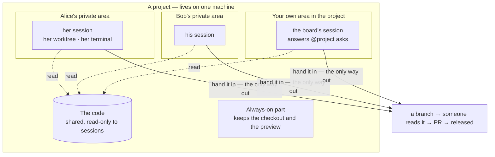
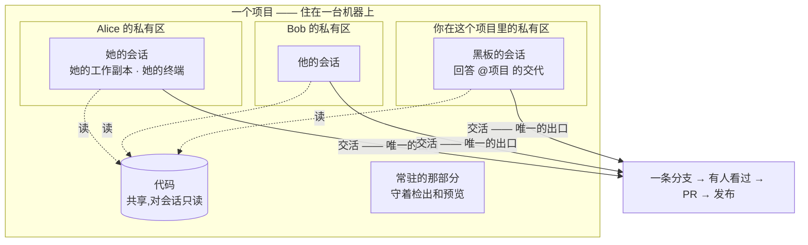

<div align="right">

**English** · [中文](README.zh-CN.md)

</div>

# AgentCell

**Somewhere for an AI coding agent to actually work.**

You give AgentCell a git repository. It sets up a small private workspace for
that project and keeps it running — a checkout of the code, a live preview of
the app, and a separate place for the released version. Then you tell an agent
what you want, in ordinary words, and you can open a real terminal and watch
it work. You can type into that terminal too: interrupt it, correct it, ask
for one more thing.

Nothing the agent writes reaches your main branch on its own. Every piece of
work lands on its own branch and waits for a person to read it. Only then does
it become a pull request.

### What using it looks like

1. **Make a project.** Point it at a repo, pick an agent and a model from a
   list. The workspace comes up in about a minute.
2. **Ask for something.** Type it on the project board — `@shop make the product
   cards two columns` — or from the project page.
3. **Watch, or don't.** The agent answers on the board when it takes the job
   and again when it finishes. If you want to see what it is doing, open its
   terminal.
4. **Read what it did.** The work arrives as a branch with a diff. Approve it
   and it becomes a pull request; release it and it goes to the production
   zone.

Nobody needs to know Kubernetes to do any of that. It runs on Kubernetes so
that projects cannot tread on each other, and so a machine restarting does
not lose your work.

> **Status: alpha.** The full path is verified on real single-node k3s —
> auth → reconcile → preview → dispatch → **terminal** → settle → pushed
> branch → **review → PR** → release → production
> ([E2E results](docs/E2E_RESULTS.md)). The review queue and the browser
> terminal both shipped; what is still designed-only is listed in the table
> below, which is the honest version of this paragraph. Evaluate before
> trusting it with production apps.
>
> **One machine is a real deployment here.** k3s on a single node gives
> namespaces, quotas, declarative reconciliation and volumes — most of what
> AgentCell uses it for. What one node cannot give is high availability, or
> more than one machine pool: add a node and both become real.

## Why

- **The project is the atom.** Ephemeral sandboxes pay a cold-start tax per
  task; human workspaces don't manage agents. AgentCell keeps one project
  environment warm — its repo, its preview, its production zone — and gives
  each person working there a single live session inside it: their own git
  worktree, their own terminal, their own conversation. Not one session per
  task; the agent CLIs already open and switch conversations, and a second
  layer of that only ever got in the way.
- **Idle is asleep, not finished.** A session nobody is using gives back its
  slot and its runtime and keeps its worktree and conversation, so coming
  back costs a few seconds rather than starting over — and nothing is
  published because you went to lunch.
- **Watch while you steer.** Each Cell keeps the product's dev server running;
  the UI puts the living product description next to the live preview so you
  recalibrate against what the agent is building, in real time.
- **Credentials stay out of reach.** Model keys are injected per session. With
  the git-broker (default), **no workload pod holds the forge token** — pods
  authenticate with an audience-scoped ServiceAccount token; only the settle
  role may push, create-only, to its own branch. The preview a project serves
  is repo- and agent-authored, so it runs on **its own origin per Cell and
  zone** and the proxy strips every platform credential before the request
  reaches it — while the app keeps full same-origin powers over itself.
- **China-cloud friendly.** Providers are data, not code: Alibaba Bailian,
  Tencent Hunyuan, DeepSeek, Moonshot, Zhipu work through their OpenAI-/
  Anthropic-compatible endpoints with no proxy.

## The model

Everything AgentCell does is one of eight nouns acting on another. Learning
those, and which one owns which, is most of learning the system.

| Thing | In one line | Why you'd care |
|---|---|---|
| **Project** | one repository, set up and kept running | it is the unit everything else hangs off |
| **Session** | your working copy and your terminal in a project | one per person; it is where you talk to the agent |
| **Board** | the project's message stream | ask for work here, get told here when it is done |
| **Slot** | permission to use the machine in a project | limits how many **people** work there at once, not how many tasks |
| **Machine pool** | a class of machine an admin offers | which server a project runs on |
| **Model key** | your API key | yours to add, yours to spend, never shared by accident |
| **Review** | finished work waiting to be read | nothing becomes a PR before this |

The relationships that carry the design:

```
Cell ──placed on──▶ Pool (one node; the Cell cannot span nodes)
                   │
                   ├── anchor ........ the shared checkout + base preview
                   └── Runtime (per user, 0700) ──▶ Session (a tmux window)
                                                      │
                                        ┌─────────────┼──────────────┐
                                     worktree     conversation     Slot
                                        └────── settle ────────▶ Review ─▶ PR ─▶ Release
```

**A project is shared; a person's runtime is not.** Collaboration happens at
the project layer — branches, reviews, the knowledge base — never at the
process layer. Nobody attaches to anybody else's terminal.



Read it like this: **the project is the thing that lasts.** Inside it, each
person gets their own corner — their own copy of the files, their own
terminal — and those corners cannot see into each other. The project gets one
too, which is what answers questions asked on the board. The only way
anything leaves is by being handed in, and a person reads it before it counts.

<details>
<summary>同一张图,中文</summary>



</details>

Four rules follow from the picture, and they are worth stating plainly.

**One workspace per person, not one per task.** The agent tools already know
how to keep several conversations going and switch between them. AgentCell
does not add a second layer of that. You get one working session in a
project; asking for another thing continues the same conversation, in the
same terminal, with everything it already knows.

**You can watch, and you can interrupt.** The terminal in your browser is
attached to the same session the agent is typing in — not a copy, not a log.
That matters because an agent working quietly and an agent stuck look
identical from outside until you can see the screen.

**Idle means asleep, not finished.** If nobody is using a session — no agent
running, nobody watching — it goes to sleep after about fifteen minutes. It
gives back the machine it was holding and keeps your files and your
conversation. Opening its terminal wakes it up where you left it, in a few
seconds. Going to lunch does not publish your work, and it does not throw it
away either.

**Handing work in is the only way out.** Your working copy can sit there as
long as you like. Nothing reaches a branch until you hand it in, and nothing
reaches production until a person has read it.

Full diagrams (control plane, lifecycle, git-broker): **[docs/ARCHITECTURE.md](docs/ARCHITECTURE.md)**.

## Implemented vs designed

| Capability | State |
|---|---|
| Cell operator (namespace / PVC / anchor / preview) · Session lifecycle (slot gate → settle Job → reclaim) | ✅ tested |
| Settle data-safety (push-confirmed-or-retry, worktree kept) | ✅ real-git tested |
| Resident preview + calibration UI (React SPA embedded in celld) · two-zone release (branch/tag/SHA, rollback) | ✅ |
| **Untrusted content isolated by origin**: each Cell *zone* on its own host, single-use tickets, no platform credential ever reaches repo code | ✅ tested ([ADR-0007](docs/adr/0007-preview-origin-separation.md)) |
| Provider registry (Aliyun Bailian / Tencent Hunyuan / DeepSeek / …) | ✅ tested |
| HTTP auth (bearer + login cookie; refuses to start open) · per-Cell NetworkPolicy · PSS restricted · non-root pods | ✅ |
| Race-free slot leases (+ crash recovery) | ✅ tested |
| **git-broker**: forge token in no workload pod; per-role SAs; audience-bound tokens; repo↔cred binding; push verified by pod uid+owner; create-only `session/<id>` | ✅ tested ([ADR-0005](docs/adr/0005-git-broker.md)) |
| Real-cluster (k3s) e2e — all 8 steps incl. preview & production HTTP 200 | ✅ ([Run 3](docs/E2E_RESULTS.md)) |
| **Self-hosted GitLab** as a first-class forge (compare / MR create / track) | ✅ tested ([Run 4](docs/E2E_RESULTS.md)) |
| Private registries: pull secret mirrored into every Cell namespace | ✅ tested |
| **User identity**: OIDC verified by celld itself (no trusted headers, no gateway required); immutable Session owner; not-yours answers 404 | ✅ tested ([ADR-0008](docs/adr/0008-user-identity-and-ownership.md)) |
| Registration & login via Casdoor, edge via Apache APISIX® — both **optional**, any OIDC provider works | ✅ manifests ([deploy/identity](deploy/identity/)) |
| **Runtime isolation**: per-user Unix uid (allocated, never recycled), `0700` private tree for worktrees / `$HOME` / CLI state / tmux socket | ✅ tested ([Run 5](docs/E2E_RESULTS.md), [ADR-0009](docs/adr/0009-runtime-isolation.md)) |
| **Resident sessions**: slot outlives the agent, follow-ups continue the CLI's own conversation, settle still mandatory | ✅ tested ([Run 6](docs/E2E_RESULTS.md), [ADR-0010](docs/adr/0010-resident-sessions.md)) |
| One tmux runtime per user hosting many sessions as windows; model key never in argv | ✅ tested ([Run 7](docs/E2E_RESULTS.md)) |
| **Runners are data**: add or fix an agent CLI in `runners.d/*.yaml`, no release needed ([docs/RUNNERS.md](docs/RUNNERS.md)) | ✅ tested |
| Dispatch form driven by the server catalogue: a runner narrows to the providers it can drive, defaults to its own vendor, offers that provider's models and accepts any other | ✅ |
| Review queue · diff · approve→auto-PR · merge tracking (forge API via broker, celld holds no credential) | ✅ tested ([ADR-0006](docs/adr/0006-review-queue-and-pr.md)) |
| Helm chart + GHCR images + cloud presets (k3s / ACK / TKE) | ✅ `helm lint`-verified |
| **Terminal in the browser** (xterm.js ↔ tmux over WebSocket, read-write); only the session's owner may attach — a Cell maintainer may not | ✅ tested |
| **Dormancy**: an idle session gives back its slot and runtime and keeps its worktree + conversation; opening the terminal or a follow-up wakes it where it was | ✅ tested |
| **Accounts**: invitations, email login, a principal per person; a password change ends every session because the cookie signature covers the hash | ✅ tested |
| **Files**: upload a spec or a spreadsheet; text is extracted once, on upload, and lands in the worktree at `.agentcell/library/` for the agent to Read and grep | ✅ tested |
| **Interactive agent**: the resident session runs the CLI the way a person would — its own screen, its own slash commands — and a follow-up is typed at it | ✅ tested |
| **Preview**: a project serves its own work-in-progress on its own origin, shown in a tab beside the terminal | ✅ tested |
| **Members**: each project carries its own list of people and what they may do; naming the first person closes the project to everyone else | ✅ tested ([ADR-0013](docs/adr/0013-authorization.md)) |
| **Placement**: pick the machine class a Cell runs on from the pools that actually exist; taints derived, not hand-written; an unschedulable Cell reports the scheduler's own reason | ✅ tested |
| Model credentials managed by their owner in the console (write-only, last-four hint) | ✅ tested |
| In-cluster image registry for clusters that cannot reach ghcr.io, plus an 814 MB alpine devbox | ✅ tested ([TEAM_SETUP](docs/TEAM_SETUP.md)) |
| **Git isolation without a git proxy**: per-user repositories over a shared read-only base — an unpublished commit never reaches the shared object store | ✅ tested ([Run 8](docs/E2E_RESULTS.md), [ADR-0012](docs/adr/0012-git-isolation-decision.md)) |
| **Production elsewhere**: a Cell runs its own isolated production zone, or hands the release to a system that owns running it (signed webhook) | ✅ tested |
| Capacity: every workload declares requests/limits and a ResourceQuota caps each Cell. Note a resident session is a tmux window, so it shares its owner's runtime budget — Kubernetes reserves per pod, and a window is not a pod | ✅ tested ([Run 8](docs/E2E_RESULTS.md)) |
| Re-attaching a restored window to the CLI's own conversation (the window comes back; the CLI is not told to resume into it) | ⬜ designed |
| **celld leader election**: one replica reconciles, every replica serves the console, ~4s takeover measured on a killed leader | ✅ tested |
| Single-use preview tickets enforced across replicas (redemption is an atomic create against the API server, not a map in one process) | ✅ tested |
| **Board**: one stream per project — saying something there IS asking that project's agent, no `@cell` needed; `@user` mentions; the board's conversation is its own session, not the asker's | ✅ tested |
| **One live session per person per Cell**, with follow-ups queued and delivered on wake; the slot cap bounds people, not tasks | ✅ tested |
| **PlacementClass**: an administrator offers machine pools; nothing a maintainer sends can become a node selector or a toleration | ✅ tested |
| **Create-a-project by choosing**: devbox, runner and provider as cards narrowed to what can be driven; only name and repo are typed | ✅ |
| Database *configuration* per zone (dev and prod name separate secrets; the platform injects, never provisions) | ✅ |
| Per-user NetworkPolicy · agent-sandbox substrate · multi-node RWX | ⬜ designed |
| Provisioning a database, or deploying a Cell to another cluster or cloud account | ⬜ not built |

## Install (one command)

Published images and chart live on GHCR, so a cluster with internet access
needs nothing built locally:

```sh
helm install agentcell oci://ghcr.io/zippo1908/charts/agentcell \
  --namespace agentcell-system --create-namespace \
  --set celld.auth.tokens="{$(openssl rand -hex 24)}" \
  --set preview.domain=preview.example.com --set preview.ingress.enabled=true
```

`preview.domain` gives every Cell zone its own host
(`<cell>-dev.…`, `<cell>-prod.…`) and needs a wildcard DNS record and
certificate. **Set it for any deployment whose repositories aren't fully
trusted** — without it all Cells share one preview origin
([ADR-0007](docs/adr/0007-preview-origin-separation.md)).

Presets for k3s / Alibaba ACK / Tencent TKE: `-f deploy/presets/<name>.yaml`.
Then create the git credential + model key and your first Cell (the chart
prints the exact commands). Full walkthrough: [docs/DEPLOYMENT.md](docs/DEPLOYMENT.md).

## Build from source

```sh
# 1. Build images and import them into the cluster (single node: k3s)
make build build-runtime-static
podman build -t ghcr.io/agentcell/celld      -f images/celld/Containerfile .
podman build -t ghcr.io/agentcell/git-broker -f images/git-broker/Containerfile .
podman build -t ghcr.io/agentcell/devbox     -f images/devbox/Containerfile .
for i in celld git-broker devbox; do podman save ghcr.io/agentcell/$i | sudo k3s ctr images import -; done

# 2. Install the control plane (curl -sfL https://get.k3s.io | sh - for k3s)
kubectl apply -f config/crd/ -f config/install.yaml

# 3. Secrets: API token, git credential (bound to its repo), model key
kubectl -n agentcell-system create secret generic celld-tokens --from-literal=tokens="$(openssl rand -hex 24)"
kubectl -n agentcell-system create secret generic git-cred --type=kubernetes.io/basic-auth \
  --from-literal=username=bot --from-literal=password=ghp_... \
  --from-literal=repo_url=https://github.com/you/shop.git
kubectl -n agentcell-system create secret generic bailian-key --from-literal=key=sk-...
kubectl -n agentcell-system rollout restart deploy/celld

# 4. A Cell with a resident preview, then dispatch and watch it live
cellctl cell create shop --repo https://github.com/you/shop.git \
  --image ghcr.io/agentcell/devbox --secret git-cred \
  --preview "npm run dev -- --host" --preview-port 5173 --description "极简电商"
cellctl dispatch shop --task "把商品卡片改成两列" \
  --runner claude --provider aliyun-bailian --model qwen3-coder-plus --cred bailian-key --follow

# 5. Open the UI
kubectl -n agentcell-system port-forward svc/celld 8080:80   # http://localhost:8080, log in with the token
```

**Working alongside the agent** — every session is resident by default: it
runs in a terminal you can open, keeps its slot while you are using it, and
lets you say one more thing in the same conversation instead of dispatching a
fresh one that has to rediscover everything.

```sh
cellctl dispatch shop --task "把商品卡片改成两列" ...              # resident unless you ask otherwise
curl -H "Authorization: Bearer $TOKEN" .../api/sessions/$S/state    # working? finished? exit code?
curl -X POST ... -d '{"text":"两列太挤了,间距加大一点"}' .../api/sessions/$S/continue
# the terminal: the console's session row, or from a shell —
kubectl -n cell-shop exec -it runtime-100000 -- /agentcell/cell-runtime attach $ID
curl -X DELETE ... .../api/sessions/$S                              # settle: commit, push, review
```

Every session of yours in a Cell is a window in **your** runtime, on a tmux
socket only your uid can open. Someone else's running session is invisible **in
the console** until they settle it — that is ownership filtering in the API.
Anyone with cluster access can of course read the CRs; that is a different
level of authorization, and AgentCell does not pretend otherwise.

## Multi-user

Three ways in, from smallest to largest deployment.

**A token.** Out of the box AgentCell has one principal: whoever holds it.
Right for one operator; say so rather than implying isolation that is not
there.

**Accounts, in a file.** Point celld at a SQLite file and it grows people:
invitations, email logins, and a principal per human — each with their own
ownership, uid and runtime.

```sh
--set accounts.db=/var/lib/agentcell/agentcell.db \
--set accounts.bootstrapAdmin=you@example.com   # with AGENTCELL_BOOTSTRAP_PASSWORD
```

There is no self-registration: an account here comes with a shell inside the
cluster, so somebody already inside hands it over deliberately. The invite
link is one-time, expires on its own, and is stored only as a hash.

**OIDC.** Point it at a provider and identity comes from there instead:

```sh
helm upgrade --install agentcell oci://ghcr.io/zippo1908/charts/agentcell \
  --set oidc.issuer=https://casdoor.example.com --set oidc.clientID=... \
  --set oidc.existingSecret=oidc
```

celld verifies the ID token against the provider's JWKS **itself** — it never
trusts an identity header, because anything on the pod network could send
one. So no gateway is required and any standards-compliant provider works.
[`deploy/identity/`](deploy/identity/) has a Casdoor + Apache APISIX® path
for registration, login and TLS if you want one ready-made.

Production walkthrough (ingress/TLS, storage, upgrades, troubleshooting):
**[docs/DEPLOYMENT.md](docs/DEPLOYMENT.md)**.

## Components

- **`celld`** — operator for the `Cell`/`Session` CRDs plus two HTTP
  surfaces: the console (React SPA + API, `:8080`) and, on a **separate
  origin**, the untrusted-content proxy (`:8081`). The SPA lives in `web/`
  and is embedded with `go:embed`, so this is still one binary.
- **`git-broker`** — the only component holding forge credentials; an
  authenticating git proxy.
- **`cell-runtime`** — static multi-call binary, PID 1 of anchor/session/prod
  pods.
- **`cellctl`** — operator CLI.

Deploy on any conformant Kubernetes: bring-your-own (single-node k3s for
on-prem private cloud) or managed (Alibaba ACK / Tencent TKE), per
[ADR-0003](docs/adr/0003-kubernetes-foundation.md).

## Docs

[Architecture](docs/ARCHITECTURE.md) · [Deployment](docs/DEPLOYMENT.md) ·
[Roadmap](docs/ROADMAP.md) · [ADRs](docs/adr/) ·
[Contributing](CONTRIBUTING.md) · [Security](SECURITY.md) ·
[good first issues](https://github.com/zippo1908/agentcell/labels/good%20first%20issue)

## License

Apache-2.0. See [LICENSE](LICENSE).
