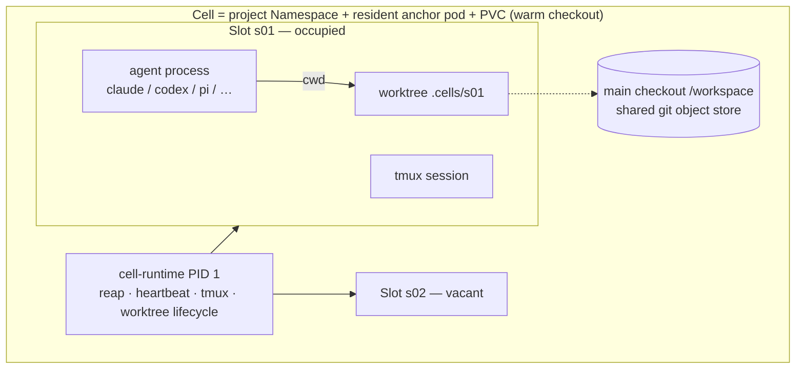

# AgentCell

**A workshop for AI coding agents: one resident container per project ("Cell"), disposable work sessions as slots inside it, and the full SDLC loop — dispatch → work → settle → review → PR → deploy — closed within the instance.**

> Status: **pre-alpha (M0 bootstrap)**. See [docs/PLAN.md](docs/PLAN.md) for the milestone map.

## Why

- **Resident Cell, disposable Slot.** Ephemeral sandboxes (E2B/Daytona-style) pay a cold-start tax on every task; workspaces for humans (Coder/Gitpod) don't manage agents. AgentCell keeps the project environment warm — checkout, toolchain, credentials — while each work session gets its own git worktree, tmux session, and cgroup budget, and is *settled and reclaimed* when it goes offline.
- **SDLC loop built in.** A session that produced commits pushes a `session/*` branch into a review queue; approval opens a PR; nothing an agent did is lost, and nothing lands unreviewed.
- **Credentials never enter the container.** Agent tokens are injected per session; git/forge tokens live only in a host-side broker that executes push/PR on the container's behalf.
- **China-cloud friendly, first-class.** Model providers are data, not code: Alibaba Cloud Bailian (DashScope), Tencent Hunyuan, DeepSeek, Moonshot/Kimi, Zhipu work out of the box via their OpenAI-/Anthropic-compatible endpoints, no proxy needed on domestic servers. See [docs/adr/0002-provider-access-layer.md](docs/adr/0002-provider-access-layer.md).

## Core model



Session lifecycle: `dispatch → work → settle → reclaim`. **Settle is mandatory**: commits are pushed as a `session/<id>` branch into the review queue; empty sessions are discarded; crashed sessions have their scene packaged before cleanup. A resident Cell never accumulates garbage.

## Architecture

**Kubernetes is the foundation** ([ADR-0003](docs/adr/0003-kubernetes-foundation.md)). Deploying AgentCell is a choice between two shapes of the same thing:

- **Bring your own K8s = on-prem private cloud.** Single machine? `k3s` + `helm install agentcell` and you're running in minutes. Nothing leaves your network.
- **Managed K8s from a cloud vendor.** Alibaba Cloud ACK and Tencent Cloud TKE are first-class (Helm values presets in `deploy/presets/`, incl. ECI / super-node elastic sessions); any conformant cluster works.

Components:

- **`celld`** — a standard operator (controller-manager) reconciling two CRDs: **Cell** (project: Namespace + resident StatefulSet anchor + PVC holding the warm checkout) and **Session** (one work session: a Pod sharing the Cell's PVC, `resources.limits` as the slot budget, a finalizer that runs *settle* before reclaim).
- **`cell-runtime`** — static multi-call binary, PID 1 of anchor and session pods (tmux, heartbeat, worktree lifecycle).
- **`cellctl`** — operator CLI; v0.1 is CLI-first.
- **git broker** — in-cluster deployment holding forge tokens; session pods reach the forge only through it (NetworkPolicy-enforced).

Isolation: namespace per project, Pod Security (restricted), non-root containers, NetworkPolicy, optional RuntimeClass (Kata/gVisor) for a hard-isolation tier.

## Build

```sh
make build          # bin/{celld,cell-runtime,cellctl}
make test lint
```

Requires Go 1.26+. Running the platform requires a Kubernetes cluster (single-node k3s is the supported quick path).

## License

Apache-2.0. See [LICENSE](LICENSE).

---

# AgentCell(中文)

**AI 开发员工的车间:每个项目一个常驻容器(Cell),会话是实例内的一次性工位(Slot),SDLC 闭环——派工 → 干活 → 清算 → 批阅 → PR → 发布——在实例内完成。**

> 状态:**pre-alpha(M0 自举)**。里程碑见 [docs/PLAN.md](docs/PLAN.md)。

## 为什么

- **常驻 Cell + 一次性 Slot**:一次性沙盒每单都交冷启动税,人用的 workspace 又不管 agent。AgentCell 让项目环境保持热态(检出/工具链/凭据),每个会话独占 worktree + tmux + cgroup 限额,下线即清算回收。
- **SDLC 闭环内建**:有产出的会话推 `session/*` 分支进批阅队列,通过即开 PR——agent 干的活不丢,也不未审入主干。
- **凭据不进容器**:agent 令牌按会话注入;git 令牌只在宿主 broker,由它代跑 push/PR。
- **国内云一等公民**:模型服务商是数据不是代码——阿里云百炼(DashScope)、腾讯混元、DeepSeek、月之暗面 Kimi、智谱 GLM 开箱即用(OpenAI/Anthropic 兼容端点,国内服务器免代理)。设计见 [ADR-0002](docs/adr/0002-provider-access-layer.md)。

## 开发状态

M0(仓库自举)进行中,主干路线 M0→M4 见 [docs/PLAN.md](docs/PLAN.md);M4(会话槽位)是核心里程碑。
