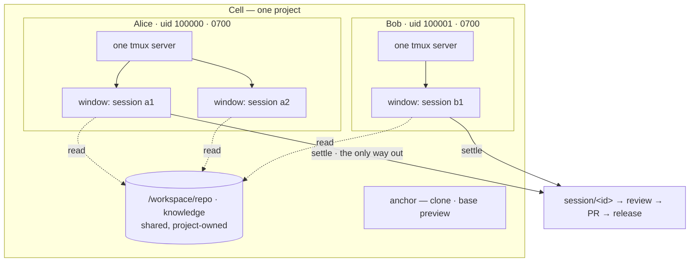

<div align="right">

**English** · [中文](README.zh-CN.md)

</div>

# AgentCell

**A workshop for AI coding agents.** One resident, Kubernetes-backed instance
per project (a *Cell*); disposable work sessions as slots inside it; a live
product preview to steer against; and an SDLC loop — dispatch → work → settle
→ review → release — closed within the instance.

> **Status: alpha.** The full path passes an 8-step end-to-end run on real
> single-node k3s (auth → reconcile → preview → dispatch → settle → pushed
> branch → release → production, [E2E results](docs/E2E_RESULTS.md)). Not yet
> a review/PR approval queue (roadmap). Evaluate before trusting it with
> production apps — the table below says exactly what's implemented vs
> designed.

## Why

- **Resident Cell, disposable Slot.** Ephemeral sandboxes pay a cold-start tax
  per task; human workspaces don't manage agents. AgentCell keeps the project
  environment warm while each session gets its own git worktree and resource
  budget, and is *settled* on the way out — commits pushed to a `session/<id>`
  branch, empty sessions discarded, nothing left behind.
- **Watch while you steer.** Each Cell keeps the product's dev server running;
  the UI puts the living product description next to the live preview so you
  recalibrate against what the agent is building, in real time.
- **Credentials stay out of reach.** Model keys are injected per session. With
  the git-broker (default), **no workload pod holds the forge token** — pods
  authenticate with an audience-scoped ServiceAccount token; only the settle
  role may push, create-only, to its own branch. The preview a project serves
  is repo- and agent-authored, so it runs on **its own origin per Cell and
  zone** and the proxy strips every platform credential before the request
  reaches it — while the app keeps full same-origin powers over itself.
- **China-cloud friendly.** Providers are data, not code: Alibaba Bailian,
  Tencent Hunyuan, DeepSeek, Moonshot, Zhipu work through their OpenAI-/
  Anthropic-compatible endpoints with no proxy.

## Core model

**A project is shared. A person's runtime is not.** Collaboration happens at
the project layer — branches, reviews, the knowledge base — never at the
process layer. Nobody attaches to anybody else's terminal.



One tmux per **user**, not per session: the agent CLIs manage conversations
themselves (Claude Code by an id we choose, Codex by its own), so the
platform gives them a private `$HOME` to keep that state in and a terminal
that outlives any single run — and stays out of the way otherwise.

Settle is the only door to the project layer. A worktree may live as long as
its owner wants; nothing reaches a branch without going through it.

Full diagrams (control plane, lifecycle, git-broker): **[docs/ARCHITECTURE.md](docs/ARCHITECTURE.md)**.

## Implemented vs designed

| Capability | State |
|---|---|
| Cell operator (namespace / PVC / anchor / preview) · Session lifecycle (slot gate → settle Job → reclaim) | ✅ tested |
| Settle data-safety (push-confirmed-or-retry, worktree kept) | ✅ real-git tested |
| Resident preview + calibration UI (React SPA embedded in celld) · two-zone release (branch/tag/SHA, rollback) | ✅ |
| **Untrusted content isolated by origin**: each Cell *zone* on its own host, single-use tickets, no platform credential ever reaches repo code | ✅ tested ([ADR-0007](docs/adr/0007-preview-origin-separation.md)) |
| Provider registry (Aliyun Bailian / Tencent Hunyuan / DeepSeek / …) | ✅ tested |
| HTTP auth (bearer + login cookie; refuses to start open) · per-Cell NetworkPolicy · PSS restricted · non-root pods | ✅ |
| Race-free slot leases (+ crash recovery) | ✅ tested |
| **git-broker**: forge token in no workload pod; per-role SAs; audience-bound tokens; repo↔cred binding; push verified by pod uid+owner; create-only `session/<id>` | ✅ tested ([ADR-0005](docs/adr/0005-git-broker.md)) |
| Real-cluster (k3s) e2e — all 8 steps incl. preview & production HTTP 200 | ✅ ([Run 3](docs/E2E_RESULTS.md)) |
| **Self-hosted GitLab** as a first-class forge (compare / MR create / track) | ✅ tested ([Run 4](docs/E2E_RESULTS.md)) |
| Private registries: pull secret mirrored into every Cell namespace | ✅ tested |
| **User identity**: OIDC verified by celld itself (no trusted headers, no gateway required); immutable Session owner; not-yours answers 404 | ✅ tested ([ADR-0008](docs/adr/0008-user-identity-and-ownership.md)) |
| Registration & login via Casdoor, edge via Apache APISIX® — both **optional**, any OIDC provider works | ✅ manifests ([deploy/identity](deploy/identity/)) |
| **Runtime isolation**: per-user Unix uid (allocated, never recycled), `0700` private tree for worktrees / `$HOME` / CLI state / tmux socket | ✅ tested ([Run 5](docs/E2E_RESULTS.md), [ADR-0009](docs/adr/0009-runtime-isolation.md)) |
| **Resident sessions**: slot outlives the agent, follow-ups continue the CLI's own conversation, settle still mandatory | ✅ tested ([Run 6](docs/E2E_RESULTS.md), [ADR-0010](docs/adr/0010-resident-sessions.md)) |
| One tmux runtime per user hosting many sessions as windows; model key never in argv | ✅ tested ([Run 7](docs/E2E_RESULTS.md)) |
| **Runners are data**: add or fix an agent CLI in `runners.d/*.yaml`, no release needed ([docs/RUNNERS.md](docs/RUNNERS.md)) | ✅ tested |
| Dispatch form driven by the server catalogue: a runner narrows to the providers it can drive, defaults to its own vendor, offers that provider's models and accepts any other | ✅ |
| Review queue · diff · approve→auto-PR · merge tracking (forge API via broker, celld holds no credential) | ✅ tested ([ADR-0006](docs/adr/0006-review-queue-and-pr.md)) |
| Helm chart + GHCR images + cloud presets (k3s / ACK / TKE) | ✅ `helm lint`-verified |
| Terminal attach in the browser (tmux over WebSocket) — `kubectl exec … cell-runtime attach <id>` works today | ⬜ designed (M5) |
| **Git isolation without a git proxy**: per-user repositories over a shared read-only base — an unpublished commit never reaches the shared object store | ✅ tested ([Run 8](docs/E2E_RESULTS.md), [ADR-0012](docs/adr/0012-git-isolation-decision.md)) |
| **Production elsewhere**: a Cell runs its own isolated production zone, or hands the release to a system that owns running it (signed webhook) | ✅ tested |
| Capacity is enforced: every workload declares requests/limits, a ResourceQuota caps each Cell | ✅ tested ([Run 8](docs/E2E_RESULTS.md)) |
| Resume a conversation after its runtime pod is replaced (the window is restored; re-attaching it to the CLI conversation is not wired) | ⬜ designed |
| Per-user NetworkPolicy · agent-sandbox substrate · multi-node RWX | ⬜ designed |

## Install (one command)

Published images and chart live on GHCR, so a cluster with internet access
needs nothing built locally:

```sh
helm install agentcell oci://ghcr.io/zippo1908/charts/agentcell \
  --namespace agentcell-system --create-namespace \
  --set celld.auth.tokens="{$(openssl rand -hex 24)}" \
  --set preview.domain=preview.example.com --set preview.ingress.enabled=true
```

`preview.domain` gives every Cell zone its own host
(`<cell>-dev.…`, `<cell>-prod.…`) and needs a wildcard DNS record and
certificate. **Set it for any deployment whose repositories aren't fully
trusted** — without it all Cells share one preview origin
([ADR-0007](docs/adr/0007-preview-origin-separation.md)).

Presets for k3s / Alibaba ACK / Tencent TKE: `-f deploy/presets/<name>.yaml`.
Then create the git credential + model key and your first Cell (the chart
prints the exact commands). Full walkthrough: [docs/DEPLOYMENT.md](docs/DEPLOYMENT.md).

## Build from source

```sh
# 1. Build images and import them into the cluster (single node: k3s)
make build build-runtime-static
podman build -t ghcr.io/agentcell/celld      -f images/celld/Containerfile .
podman build -t ghcr.io/agentcell/git-broker -f images/git-broker/Containerfile .
podman build -t ghcr.io/agentcell/devbox     -f images/devbox/Containerfile .
for i in celld git-broker devbox; do podman save ghcr.io/agentcell/$i | sudo k3s ctr images import -; done

# 2. Install the control plane (curl -sfL https://get.k3s.io | sh - for k3s)
kubectl apply -f config/crd/ -f config/install.yaml

# 3. Secrets: API token, git credential (bound to its repo), model key
kubectl -n agentcell-system create secret generic celld-tokens --from-literal=tokens="$(openssl rand -hex 24)"
kubectl -n agentcell-system create secret generic git-cred --type=kubernetes.io/basic-auth \
  --from-literal=username=bot --from-literal=password=ghp_... \
  --from-literal=repo_url=https://github.com/you/shop.git
kubectl -n agentcell-system create secret generic bailian-key --from-literal=key=sk-...
kubectl -n agentcell-system rollout restart deploy/celld

# 4. A Cell with a resident preview, then dispatch and watch it live
cellctl cell create shop --repo https://github.com/you/shop.git \
  --image ghcr.io/agentcell/devbox --secret git-cred \
  --preview "npm run dev -- --host" --preview-port 5173 --description "极简电商"
cellctl dispatch shop --task "把商品卡片改成两列" \
  --runner claude --provider aliyun-bailian --model qwen3-coder-plus --cred bailian-key --follow

# 5. Open the UI
kubectl -n agentcell-system port-forward svc/celld 8080:80   # http://localhost:8080, log in with the token
```

**Working alongside the agent** — a resident session keeps its slot after the
agent finishes, so you can look at the result and say one more thing in the
same conversation instead of dispatching a fresh one that has to rediscover
everything:

```sh
cellctl dispatch shop --task "把商品卡片改成两列" --resident ...   # or "resident": true via the API
curl -H "Authorization: Bearer $TOKEN" .../api/sessions/$S/state    # working? finished? exit code?
curl -X POST ... -d '{"text":"两列太挤了,间距加大一点"}' .../api/sessions/$S/continue
kubectl -n cell-shop exec -it runtime-100000 -- /agentcell/cell-runtime attach $ID
curl -X DELETE ... .../api/sessions/$S                              # settle: commit, push, review
```

Every session of yours in a Cell is a window in **your** runtime, on a tmux
socket only your uid can open. Someone else's running session is invisible **in
the console** until they settle it — that is ownership filtering in the API.
Anyone with cluster access can of course read the CRs; that is a different
level of authorization, and AgentCell does not pretend otherwise.

## Multi-user

Out of the box AgentCell has one principal: whoever holds the token. Point it
at an OIDC provider and each person gets their own ownership, uid and
runtime:

```sh
helm upgrade --install agentcell oci://ghcr.io/zippo1908/charts/agentcell \
  --set oidc.issuer=https://casdoor.example.com --set oidc.clientID=... \
  --set oidc.existingSecret=oidc
```

celld verifies the ID token against the provider's JWKS **itself** — it never
trusts an identity header, because anything on the pod network could send
one. So no gateway is required and any standards-compliant provider works.
[`deploy/identity/`](deploy/identity/) has a Casdoor + Apache APISIX® path
for registration, login and TLS if you want one ready-made.

Production walkthrough (ingress/TLS, storage, upgrades, troubleshooting):
**[docs/DEPLOYMENT.md](docs/DEPLOYMENT.md)**.

## Components

- **`celld`** — operator for the `Cell`/`Session` CRDs plus two HTTP
  surfaces: the console (React SPA + API, `:8080`) and, on a **separate
  origin**, the untrusted-content proxy (`:8081`). The SPA lives in `web/`
  and is embedded with `go:embed`, so this is still one binary.
- **`git-broker`** — the only component holding forge credentials; an
  authenticating git proxy.
- **`cell-runtime`** — static multi-call binary, PID 1 of anchor/session/prod
  pods.
- **`cellctl`** — operator CLI.

Deploy on any conformant Kubernetes: bring-your-own (single-node k3s for
on-prem private cloud) or managed (Alibaba ACK / Tencent TKE), per
[ADR-0003](docs/adr/0003-kubernetes-foundation.md).

## Docs

[Architecture](docs/ARCHITECTURE.md) · [Deployment](docs/DEPLOYMENT.md) ·
[Roadmap](docs/ROADMAP.md) · [ADRs](docs/adr/) ·
[Contributing](CONTRIBUTING.md) · [Security](SECURITY.md) ·
[good first issues](https://github.com/zippo1908/agentcell/labels/good%20first%20issue)

## License

Apache-2.0. See [LICENSE](LICENSE).
