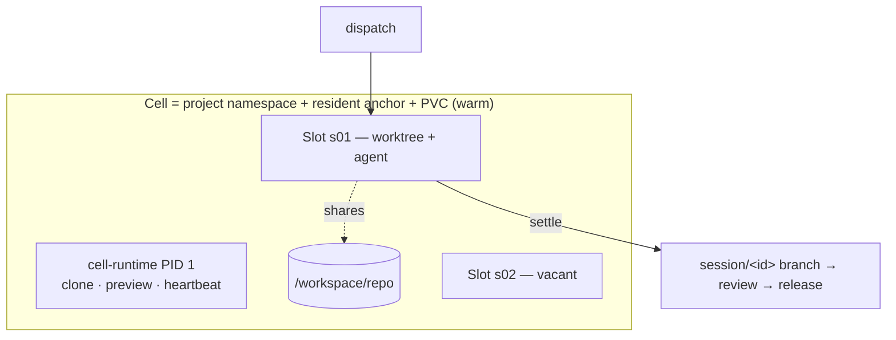

<div align="right">

**English** · [中文](README.zh-CN.md)

</div>

# AgentCell

**A workshop for AI coding agents.** One resident, Kubernetes-backed instance
per project (a *Cell*); disposable work sessions as slots inside it; a live
product preview to steer against; and an SDLC loop — dispatch → work → settle
→ review → release — closed within the instance.

> **Status: alpha.** The full path passes an 8-step end-to-end run on real
> single-node k3s (auth → reconcile → preview → dispatch → settle → pushed
> branch → release → production, [E2E results](docs/E2E_RESULTS.md)). Not yet
> a review/PR approval queue (roadmap). Evaluate before trusting it with
> production apps — the table below says exactly what's implemented vs
> designed.

## Why

- **Resident Cell, disposable Slot.** Ephemeral sandboxes pay a cold-start tax
  per task; human workspaces don't manage agents. AgentCell keeps the project
  environment warm while each session gets its own git worktree and resource
  budget, and is *settled* on the way out — commits pushed to a `session/<id>`
  branch, empty sessions discarded, nothing left behind.
- **Watch while you steer.** Each Cell keeps the product's dev server running;
  the UI puts the living product description next to the live preview so you
  recalibrate against what the agent is building, in real time.
- **Credentials stay out of reach.** Model keys are injected per session. With
  the git-broker (default), **no workload pod holds the forge token** — pods
  authenticate with an audience-scoped ServiceAccount token; only the settle
  role may push, create-only, to its own branch. The preview a project serves
  is repo- and agent-authored, so it runs on **its own origin per Cell and
  zone** and the proxy strips every platform credential before the request
  reaches it — while the app keeps full same-origin powers over itself.
- **China-cloud friendly.** Providers are data, not code: Alibaba Bailian,
  Tencent Hunyuan, DeepSeek, Moonshot, Zhipu work through their OpenAI-/
  Anthropic-compatible endpoints with no proxy.

## Core model



Full diagrams (control plane, lifecycle, git-broker): **[docs/ARCHITECTURE.md](docs/ARCHITECTURE.md)**.

## Implemented vs designed

| Capability | State |
|---|---|
| Cell operator (namespace / PVC / anchor / preview) · Session lifecycle (slot gate → settle Job → reclaim) | ✅ tested |
| Settle data-safety (push-confirmed-or-retry, worktree kept) | ✅ real-git tested |
| Resident preview + calibration UI (React SPA embedded in celld) · two-zone release (branch/tag/SHA, rollback) | ✅ |
| **Untrusted content isolated by origin**: each Cell *zone* on its own host, single-use tickets, no platform credential ever reaches repo code | ✅ tested ([ADR-0007](docs/adr/0007-preview-origin-separation.md)) |
| Provider registry (Aliyun Bailian / Tencent Hunyuan / DeepSeek / …) | ✅ tested |
| HTTP auth (bearer + login cookie; refuses to start open) · per-Cell NetworkPolicy · PSS restricted · non-root pods | ✅ |
| Race-free slot leases (+ crash recovery) | ✅ tested |
| **git-broker**: forge token in no workload pod; per-role SAs; audience-bound tokens; repo↔cred binding; push verified by pod uid+owner; create-only `session/<id>` | ✅ tested ([ADR-0005](docs/adr/0005-git-broker.md)) |
| Real-cluster (k3s) e2e — all 8 steps incl. preview & production HTTP 200 | ✅ ([Run 3](docs/E2E_RESULTS.md)) |
| Review queue · diff · approve→auto-PR · merge tracking (forge API via broker, celld holds no credential) | ✅ tested ([ADR-0006](docs/adr/0006-review-queue-and-pr.md)) |
| Helm chart + GHCR images + cloud presets (k3s / ACK / TKE) | ✅ `helm lint`-verified |
| Terminal attach (tmux over WebSocket) | ⬜ designed (M5) |
| agent-sandbox substrate · multi-node RWX | ⬜ designed |

## Install (one command)

Published images and chart live on GHCR, so a cluster with internet access
needs nothing built locally:

```sh
helm install agentcell oci://ghcr.io/zippo1908/charts/agentcell \
  --namespace agentcell-system --create-namespace \
  --set celld.auth.tokens="{$(openssl rand -hex 24)}" \
  --set preview.domain=preview.example.com --set preview.ingress.enabled=true
```

`preview.domain` gives every Cell zone its own host
(`<cell>-dev.…`, `<cell>-prod.…`) and needs a wildcard DNS record and
certificate. **Set it for any deployment whose repositories aren't fully
trusted** — without it all Cells share one preview origin
([ADR-0007](docs/adr/0007-preview-origin-separation.md)).

Presets for k3s / Alibaba ACK / Tencent TKE: `-f deploy/presets/<name>.yaml`.
Then create the git credential + model key and your first Cell (the chart
prints the exact commands). Full walkthrough: [docs/DEPLOYMENT.md](docs/DEPLOYMENT.md).

## Build from source

```sh
# 1. Build images and import them into the cluster (single node: k3s)
make build build-runtime-static
podman build -t ghcr.io/agentcell/celld      -f images/celld/Containerfile .
podman build -t ghcr.io/agentcell/git-broker -f images/git-broker/Containerfile .
podman build -t ghcr.io/agentcell/devbox     -f images/devbox/Containerfile .
for i in celld git-broker devbox; do podman save ghcr.io/agentcell/$i | sudo k3s ctr images import -; done

# 2. Install the control plane (curl -sfL https://get.k3s.io | sh - for k3s)
kubectl apply -f config/crd/ -f config/install.yaml

# 3. Secrets: API token, git credential (bound to its repo), model key
kubectl -n agentcell-system create secret generic celld-tokens --from-literal=tokens="$(openssl rand -hex 24)"
kubectl -n agentcell-system create secret generic git-cred --type=kubernetes.io/basic-auth \
  --from-literal=username=bot --from-literal=password=ghp_... \
  --from-literal=repo_url=https://github.com/you/shop.git
kubectl -n agentcell-system create secret generic bailian-key --from-literal=key=sk-...
kubectl -n agentcell-system rollout restart deploy/celld

# 4. A Cell with a resident preview, then dispatch and watch it live
cellctl cell create shop --repo https://github.com/you/shop.git \
  --image ghcr.io/agentcell/devbox --secret git-cred \
  --preview "npm run dev -- --host" --preview-port 5173 --description "极简电商"
cellctl dispatch shop --task "把商品卡片改成两列" \
  --runner claude --provider aliyun-bailian --model qwen3-coder-plus --cred bailian-key --follow

# 5. Open the UI
kubectl -n agentcell-system port-forward svc/celld 8080:80   # http://localhost:8080, log in with the token
```

Production walkthrough (ingress/TLS, storage, upgrades, troubleshooting):
**[docs/DEPLOYMENT.md](docs/DEPLOYMENT.md)**.

## Components

- **`celld`** — operator for the `Cell`/`Session` CRDs plus two HTTP
  surfaces: the console (React SPA + API, `:8080`) and, on a **separate
  origin**, the untrusted-content proxy (`:8081`). The SPA lives in `web/`
  and is embedded with `go:embed`, so this is still one binary.
- **`git-broker`** — the only component holding forge credentials; an
  authenticating git proxy.
- **`cell-runtime`** — static multi-call binary, PID 1 of anchor/session/prod
  pods.
- **`cellctl`** — operator CLI.

Deploy on any conformant Kubernetes: bring-your-own (single-node k3s for
on-prem private cloud) or managed (Alibaba ACK / Tencent TKE), per
[ADR-0003](docs/adr/0003-kubernetes-foundation.md).

## Docs

[Architecture](docs/ARCHITECTURE.md) · [Deployment](docs/DEPLOYMENT.md) ·
[Roadmap](docs/ROADMAP.md) · [ADRs](docs/adr/) ·
[Contributing](CONTRIBUTING.md) · [Security](SECURITY.md) ·
[good first issues](https://github.com/zippo1908/agentcell/labels/good%20first%20issue)

## License

Apache-2.0. See [LICENSE](LICENSE).
