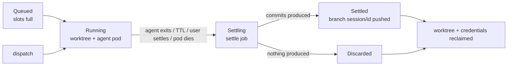

# AgentCell

**A workshop for AI coding agents: one resident Kubernetes-backed instance per project ("Cell"), disposable work sessions as slots inside it, a resident live product preview for the human to calibrate against, and an SDLC loop closed within the instance — dispatch → work → settle are implemented today; review queue → PR is on the roadmap (M7/M9).**

> Status: **pre-alpha — not yet safe for company code, tokens, or production apps.** The vertical slice (operator, runtime, resident preview, calibration UI, CLI) compiles, passes unit tests (including real-git settle tests), but has not yet run a real-cluster e2e. Read the table below for exactly what is implemented vs designed.

## Implemented vs designed

| Capability | State |
|---|---|
| Cell operator: namespace / PVC / anchor / preview Service | ✅ implemented, fake-client tested |
| Session lifecycle: slot gate → pod → TTL → settle Job → reclaim | ✅ implemented, fake-client tested |
| Settle data-safety (push-confirmed or fail-and-retry, worktree kept) | ✅ implemented, real-git tested |
| Resident preview + calibration UI + `/preview` `/app` proxies | ✅ implemented, not yet cluster-verified |
| Two-zone release (`/app`, emptyDir clone, release/rollback) | ✅ implemented; storage-isolated only — same namespace/network, NetworkPolicy pending |
| Provider registry (Aliyun Bailian / Tencent Hunyuan / …) | ✅ implemented, unit tested |
| Real-cluster (k3s) e2e | ⬜ next milestone |
| Review queue, diff approval, auto-PR, merge tracking | ⬜ designed (M7/M9) |
| Terminal attach (tmux over WebSocket) | ⬜ designed (M5) |
| NetworkPolicy / PSS restricted / non-root images | ⬜ designed (M8) |
| Git-token broker (tokens out of anchor/prod env) | ⬜ designed |
| Knowledge indexing / review-feedback distillation | ⬜ designed |

[中文版在下面 ↓](#agentcell中文)

## Why

- **Resident Cell, disposable Slot.** Ephemeral sandboxes (E2B/Daytona-style) pay a cold-start tax on every task; workspaces for humans (Coder/Gitpod) don't manage agents. AgentCell keeps the project environment warm while each work session gets its own git worktree, pod-level resource budget, and a mandatory *settle* on the way out.
- **Watch while you steer.** Every Cell keeps the product's dev server running for its whole life. The UI puts the living product description next to the live preview: dispatch a task, watch the agent's work render in real time, recalibrate the description, dispatch again.
- **Nothing gets lost.** A session that produced commits settles into a `session/<id>` branch; the settle job succeeds only after the push is confirmed — otherwise it fails, retries, and keeps the worktree on disk (real-git tested). Review/approval of those branches is roadmap (M7/M9); today they wait on the forge.
- **Session pods never see forge credentials.** Model keys are injected per session via secret indirection ($(VAR), literal never in the pod spec — unit-tested). Honest limitation: anchor, settle and production pods do receive the git token via env, and they execute repo-controlled commands — a host-side broker (the AIP pattern) is designed to close this.
- **China-cloud friendly, first-class.** Providers are data, not code: Alibaba Cloud Bailian, Tencent Hunyuan, DeepSeek, Moonshot/Kimi, Zhipu work through their OpenAI-/Anthropic-compatible endpoints, no proxy on domestic servers ([ADR-0002](docs/adr/0002-provider-access-layer.md)).

## What exactly is on one instance?

Creating one `Cell` CR materializes, in its own namespace `cell-<name>`:

| Piece | What it is | What it does |
|---|---|---|
| **Anchor pod** (StatefulSet ×1) | PID 1 is `cell-runtime anchor` | Clones/refreshes the repo, **keeps the resident product preview running** (supervised, backoff restart), maintains the knowledge directory, heartbeats, reaps zombies |
| **Workspace PVC** | The Cell's warm state | Layout below — checkout, per-session worktrees, knowledge, runtime state |
| **Preview Service** | ClusterIP → anchor | `celld` reverse-proxies it at `/preview/<cell>/` so the browser only ever talks to the platform |
| **Session pods** (0…maxSessions) | PID 1 is `cell-runtime session` | One per active work session: creates its worktree, runs the agent CLI headless with per-session credentials, `resources.limits` = the slot budget |
| **Settle jobs** | `cell-runtime settle` | The mandatory reckoning: autosave → push `session/<id>` if produced → reclaim worktree → verdict via termination message |
| **Secrets** | `agentcell-git`, `cred-<session>` | Forge credential (anchor + settle only) and per-session model keys (that session only) |

Workspace PVC layout:

```
/workspace
├── repo/                  # main checkout — the shared git object store,
│                          #   and what the preview serves by default
├── .cells/<session-id>/   # one git worktree per active session (reclaimed at settle)
│   └── .agentcell/
│       ├── TASK.md        # this session's work order (+ pointers below)
│       └── PRODUCT.md     # snapshot of the product description at dispatch
├── knowledge/             # persistent, session-shared knowledge (see below)
└── .agentcell/heartbeat   # anchor liveness
```

## Knowledge: what a Cell knows today

Three layers, all real, all deliberately file-based (an agent's native food):

1. **Product description** — lives on the Cell (`spec.description`), edited in the UI while watching the preview. Injected into **every** session as `.agentcell/PRODUCT.md`, so the agent always knows what the product is supposed to be.
2. **The repository itself** — code, docs, and settled `session/*` branches are the ground truth that survives everything.
3. **`/workspace/knowledge/`** — a persistent directory on the PVC, outside the checkout, shared across sessions. Every session's `TASK.md` tells the agent: read it before starting, distill reusable learnings (conventions, pitfalls, decisions) back into it as markdown. It survives session reclaim and even `cell rebuild` (it's on the PVC).

Not built yet (roadmap): indexed retrieval over the knowledge directory for large corpora, automatic distillation of review feedback into knowledge, and cross-Cell shared knowledge. The file-based contract above is designed so those bolt on without changing the session contract.

## Two zones: dev/test merged, production isolated

Each Cell has exactly two zones — development and testing are deliberately one zone, and production is structurally out of its reach:

| | Dev zone(开发区)`/preview/<cell>/` | Production(正式区)`/app/<cell>/` |
|---|---|---|
| What it serves | Main checkout or a followed session's worktree — live, messy, restartable | A release checkout, immutable until the next release |
| Storage | Shared workspace PVC | **Own emptyDir, fresh `--depth 1` clone of the release ref** — never mounts the PVC |
| Process | Anchor pod's supervised dev server | Separate Deployment + Service |
| Changes when | Every commit, every followed session, every preview restart | **Only on an explicit release** (UI button / `cellctl release <cell> [--ref v1.2]` / API) |

Because the prod pod shares no volume and no process with the dev zone, dev debugging — crashed previews, dirty worktrees, force-killed sessions — cannot change what production serves. Honest scope of that claim today: the isolation is **storage- and process-level**; both zones still share the namespace, the network and the devbox image, and the prod pod holds the git token (NetworkPolicy, a hardened prod image and a token broker are on the roadmap). `ref` must be a branch or tag (SHA pinning is roadmap). A release stamps a new `releaseID`, which rolls the prod pod, which re-clones the ref: rollback is `cellctl release <cell> --ref <previous-tag>`.

## Session lifecycle



Deleting a Session CR is safe at any moment: a finalizer guarantees settle runs first.

## Security model (and its current honest limits)

- Namespace per project; session pods run with pod-level CPU/memory limits.
- Model keys: per-session Secret + `$(VAR)` indirection — the literal never appears in a pod spec (unit-tested).
- Forge tokens: never in session pods; in anchor/settle/prod pods they arrive via env and are fed to git through an askpass shim (not written to `.git/config`). **Known gap:** those pods execute repo-controlled commands, and code they run can read the env — the designed fix is a host/cluster-side git broker.
- **Trust model within a project:** all sessions of one Cell share the workspace PVC (that's what makes worktrees share one object store), so a session can read the main checkout, other worktrees, and the knowledge dir. Isolation is strong *between* projects (namespaces), advisory *within* one.
- Pods currently run with the image default user (root in the stock devbox). Planned (M8+): non-root images, NetworkPolicy per cell namespace, Pod Security restricted, seccomp/drop-caps, optional RuntimeClass (Kata/gVisor) hard-isolation tier.

## Providers out of the box

`configs/providers.yaml`, overridable via `/etc/agentcell/providers.d/` — adding a cloud is YAML, not code:

| Provider | Region | Protocols |
|---|---|---|
| Alibaba Cloud Bailian (Qwen) | cn | openai + anthropic (Claude Code proxy) |
| Tencent Hunyuan | cn | openai |
| DeepSeek | cn | openai + anthropic |
| Moonshot Kimi | cn | openai + anthropic |
| Zhipu GLM | cn | openai + anthropic |
| Anthropic / OpenAI / OpenRouter | global | native |

Runners: `claude`, `codex`, `pi`. A (runner, provider, model) binding is valid iff their protocol sets intersect — checked at dispatch time.

## Quick start

```sh
# 1. Build and load images (or pull published ones once released)
make build build-runtime-static
podman build -t ghcr.io/agentcell/celld  -f images/celld/Containerfile .
podman build -t ghcr.io/agentcell/devbox -f images/devbox/Containerfile .

# 2. Install into any cluster (single machine: `curl -sfL https://get.k3s.io | sh -`)
kubectl apply -f config/crd/ -f config/install.yaml

# 3. Create the credentials your sessions will burn
kubectl -n agentcell-system create secret generic bailian-key --from-literal=key=sk-...
kubectl -n agentcell-system create secret generic git-cred \
  --type=kubernetes.io/basic-auth --from-literal=username=bot --from-literal=password=ghp_...

# 4. A cell with a resident product preview
cellctl cell create shop --repo https://github.com/you/shop.git \
  --image ghcr.io/agentcell/devbox --secret git-cred \
  --preview "npm run dev -- --host" --preview-port 5173 \
  --description "极简版电商:商品列表 + 购物车"

# 5. Dispatch work and watch it live
cellctl dispatch shop --task "把商品卡片改成两列布局" \
  --runner claude --provider aliyun-bailian --model qwen3-coder-plus \
  --cred bailian-key --follow
```

Open celld (`kubectl -n agentcell-system port-forward svc/celld 8080:80`) at `http://localhost:8080`.

## Components

- **`celld`** — controller-manager for the `Cell`/`Session` CRDs + HTTP surface (calibration UI, control API, preview reverse proxy).
- **`cell-runtime`** — static multi-call binary baked into devbox images: `anchor`, `session`, `settle`, `askpass`.
- **`cellctl`** — operator CLI: `cells`, `cell create`, `dispatch`, `sessions`, `settle`.

Deploy anywhere conformant: bring-your-own K8s (k3s single node = on-prem private cloud quick path) or managed K8s — Alibaba ACK / Tencent TKE presets planned in `deploy/presets/` ([ADR-0003](docs/adr/0003-kubernetes-foundation.md)).

## License

Apache-2.0. See [LICENSE](LICENSE).

---

# AgentCell(中文)

**AI 开发员工的车间:每个项目一个常驻实例(Cell),会话是实例内的一次性工位(Slot),实例自带常驻产品预览让人"边看边校准",SDLC 闭环——派工 → 干活 → 清算 → 批阅 → PR——在实例内完成。**

> 状态:**pre-alpha**。全链路纵切片(Operator、运行时、常驻预览、校准 UI、CLI)已完成并通过单测;当前里程碑是真机 e2e。详见 [docs/PLAN.md](docs/PLAN.md)。

## 一个实例上到底有什么?

建一个 `Cell` CR,就会在专属命名空间 `cell-<name>` 里长出:

| 部件 | 是什么 | 干什么 |
|---|---|---|
| **锚点 Pod**(StatefulSet ×1) | PID 1 = `cell-runtime anchor` | 克隆/刷新仓库;**常驻跑产品 dev server**(监管+退避重启);维护知识目录;心跳;收僵尸进程 |
| **workspace PVC** | Cell 的热状态 | 目录布局见下——主检出、各会话 worktree、知识库、运行时状态 |
| **preview Service** | ClusterIP → 锚点 | `celld` 反代成 `/preview/<cell>/`,浏览器只跟平台打交道 |
| **会话 Pod**(0…maxSessions 个) | PID 1 = `cell-runtime session` | 每单一个:建 worktree、带 per-session 凭据 headless 跑 agent CLI,`resources.limits` 就是槽位限额 |
| **结算 Job** | `cell-runtime settle` | 强制清算:补提交 → 有产出推 `session/<id>` 分支 → 回收 worktree → 结论走 termination message 回报 |
| **Secret** | `agentcell-git`、`cred-<会话>` | forge 凭据(只给锚点和结算)和模型 key(只给该会话) |

workspace PVC 布局:

```
/workspace
├── repo/                  # 主检出——共享 git 对象库,也是预览默认服务的目录
├── .cells/<会话id>/        # 每个活跃会话一个 worktree(清算时回收)
│   └── .agentcell/
│       ├── TASK.md        # 本单工单(含下述指路)
│       └── PRODUCT.md     # 派工时刻的产品描述快照
├── knowledge/             # 持久知识目录,跨会话共享(见下节)
└── .agentcell/heartbeat   # 锚点心跳
```

## 知识:现在一个 Cell 知道什么?

三层,全部已实现,刻意做成纯文件(agent 的母语):

1. **产品描述** —— 挂在 Cell 上(`spec.description`),你在 UI 里边看预览边改。**每单派工都注入**成会话里的 `.agentcell/PRODUCT.md`,agent 永远知道产品该长什么样。
2. **仓库本身** —— 代码、文档、清算出的 `session/*` 分支,是什么都冲不掉的真相层。
3. **`/workspace/knowledge/`** —— PVC 上、检出之外的持久目录,跨会话共享。每单的 `TASK.md` 都写明:开工前浏览,收工把可复用经验(约定、坑、决策)沉淀成 md 放回去。会话回收不影响它,`cell rebuild` 也不影响(它在 PVC 上)。

尚未做(路线图):知识目录的索引检索(大语料)、批阅意见自动蒸馏进知识、跨 Cell 共享知识。文件契约是特意设计好的,这些能力叠上去不需要改会话协议。

## 双区模型:开发测试合一,正式区结构性隔离

每个 Cell 恰好两个区——开发和测试刻意合并成一个区,正式区在结构上就够不着它:

| | 开发区 `/preview/<cell>/` | 正式区 `/app/<cell>/` |
|---|---|---|
| 服务内容 | 主检出或跟随中会话的 worktree——活的、乱的、随便重启 | 发布检出,到下次发布前不可变 |
| 存储 | 共享 workspace PVC | **自己的 emptyDir,发布 ref 的全新浅克隆——永不挂 PVC** |
| 进程 | 锚点 Pod 里被监管的 dev server | 独立 Deployment + Service |
| 何时变化 | 每个提交、每次会话跟随、每次预览重启 | **仅显式发布时**(UI 按钮 / `cellctl release` / API) |

正式区 Pod 与开发区零共享卷、零共享进程——预览崩了、worktree 脏了、会话被强杀,都改不了正式区在服务的东西。**当前隔离的诚实边界:是存储与进程级隔离;两区仍同 Namespace、同网络、同 devbox 镜像,prod Pod 持有 git 令牌(NetworkPolicy、硬化镜像、令牌 broker 在路线图);`ref` 仅支持分支/标签(SHA 固定在路线图)。**发布 = 盖一个新 `releaseID` → prod Pod 滚动 → 重新克隆 ref;回滚就是 `cellctl release <cell> --ref <上一个tag>`。

## 会话生命周期

派工(槽满则排队)→ 干活(worktree + agent Pod)→ 清算(agent 退出/TTL/手动结算/Pod 死亡都触发)→ 有产出=推 `session/<id>` 分支待批阅,无产出=丢弃 → worktree 与凭据回收。删除 Session CR 任何时刻都安全:finalizer 保证清算先跑。

## 校准闭环(这个产品的核心体验)

UI 左右分屏:左边是**产品描述编辑器 + 派工表单 + 会话列表**,右边是**常驻产品预览**。派工时勾"预览跟随这单",预览就切到该会话的 worktree——你实时看 agent 改到哪了,随手改描述,再派下一单。描述的每次校准都会进入后续所有会话的 `PRODUCT.md`。

## 安全模型 / 服务商预置 / 快速上手 / 组件

同英文版对应章节:凭据按会话经 Secret 间接注入(单测保证字面 key 不进 pod spec);git 令牌只经 askpass 进锚点与结算、不落 `.git/config`;阿里百炼/腾讯混元/DeepSeek/Kimi/智谱开箱即用,加新云=加一段 yaml;部署二选一——自带 K8s(单机 k3s)或云厂商托管(ACK/TKE 预置在路上)。
