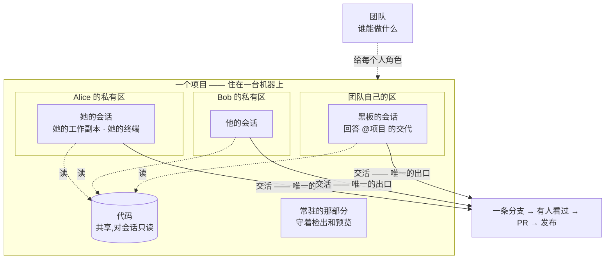
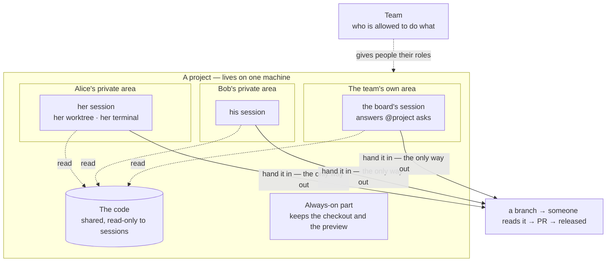

<div align="right">

[English](README.md) · **中文**

</div>

# AgentCell

**给 AI 开发员工一个真正能干活的地方。**

你把一个 git 仓库交给它。它为这个项目开一间常驻的小工作间:一份代码检出、
一个能打开看的应用预览、还有一块单独放"已发布版本"的地方。然后你用大白话
说要做什么,可以**打开一个真的终端看它干**——也可以直接在里面打字:打断它、
纠正它、再交代一件事。

**agent 写的东西不会自己进你的主干。** 每一段活都落在它自己的分支上,等人看过
才算数;看过之后才变成一个 PR。

### 用起来是什么样

1. **建一个项目。** 指一个仓库,从列表里挑 agent 和模型。工作间大约一分钟起来。
2. **交代一件事。** 在团队黑板上打 `@shop 把商品卡片改成两列`,或者从项目页派。
3. **想看就看。** agent 接单时回你一句,做完再回一句。想知道它在干嘛,就打开它
   的终端。
4. **看它做了什么。** 产出是一条带 diff 的分支。批准就变成 PR,发布就进正式区。

**这些都不需要你懂 Kubernetes。** 它跑在 Kubernetes 上,是为了让各个项目互相
踩不到,也为了机器重启不会把你的活弄丢。

> **状态:alpha。** 完整链路已在真实单节点 k3s 上验证——登录 → 对账 → 预览 →
> 派工 → **终端** → 清算 → 推分支 → **批阅 → PR** → 发布 → 正式区
> ([E2E 结果](docs/E2E_RESULTS.md))。批阅队列和浏览器终端都已上线;仍然只是
> 设计的部分列在下面的表里,那张表才是这段话的准确版本。用于生产应用前请先评估。
>
> **一台机器也是一个真实部署。** 单节点 k3s 提供命名空间、配额、声明式对账和卷
> ——AgentCell 用到的绝大部分就是这些。单节点给不了的是高可用,以及多于一个的
> 机器池:加一台机器,这两件事才成立。


## 为什么

- **项目才是原子。** 一次性沙箱每个任务都要付冷启动的账;人用的工作区又不管 agent。
  AgentCell 让一个项目的环境常驻——它的仓库、预览、正式区——并给在里面干活的每个人
  一条活会话:自己的 worktree、自己的终端、自己的对话。不是一个任务一条会话:agent
  CLI 自己就会开和切换对话,再叠一层只会碍事。
- **空闲是睡着,不是结束。** 没人用的会话交回槽位和运行时,保留 worktree 和对话,
  所以回来只花几秒而不是从头再来——也不会因为你去吃了个饭就把东西发布出去。
- **边看边校准。** 每个 Cell 常驻跑产品 dev server;UI 左边是产品描述,右边是实时
  预览——你对着 agent 正在做出来的东西随手校准。
- **凭据够不到。** 模型 key 按会话注入。开启 git-broker(默认)后**没有任何 workload
  pod 持有 forge 令牌**——pod 用 audience 绑定的 ServiceAccount 令牌认证;只有 settle
  角色能 push,且只能 create-only 推自己那一个分支。项目预览是仓库与 agent 写的代码,
  因此**按 Cell 与区各自独立 origin** 运行,代理在请求到达它之前剥掉所有平台凭据——
  而预览应用对自己仍是完整同源,毫无退化。
- **国内云友好。** 服务商是数据不是代码:阿里百炼、腾讯混元、DeepSeek、Kimi、智谱
  经其 OpenAI/Anthropic 兼容端点开箱即用,免代理。

## 概念模型

AgentCell 做的每一件事,都是八个名词之一在作用于另一个。搞清这些名词、以及谁归谁
管,就学会了这套系统的大半。

| 东西 | 一句话 | 你为什么要在意 |
|---|---|---|
| **项目** | 一个仓库,给它配好环境并一直开着 | 其他一切都挂在它上面 |
| **会话** | 你在这个项目里的工作副本和终端 | 每人一条,你就是在这儿跟 agent 说话 |
| **团队** | 一份名单,写清谁能做什么 | 加一次就行,不用每个项目加一遍 |
| **黑板** | 团队的消息流 | 在这儿交代活,也在这儿被告知做完了 |
| **槽位** | 在一个项目里占用机器的许可 | 限的是**同时几个人**在干活,不是几个任务 |
| **机器池** | 管理员提供的一类机器 | 这个项目跑在哪台服务器上 |
| **模型 key** | 你的 API key | 自己加、自己花,不会稀里糊涂被别人用掉 |
| **批阅** | 做完了、等人看的活 | 没经过这一步,不会变成 PR |

真正承载设计的是它们之间的关系:

```
Team ──治理──▶ Cell ──落在──▶ Pool(一台机器;Cell 不能跨节点)
                │
                ├── anchor ........ 共享检出 + 基础预览
                └── Runtime(每人一个,0700)──▶ Session(一个 tmux 窗口)
                                                  │
                                    ┌─────────────┼──────────────┐
                                 worktree       对话           Slot
                                    └────── 清算 ────────▶ Review ─▶ PR ─▶ 发布
```

**项目是共享的,个人的运行时不是。** 协作发生在项目层——分支、批阅、知识库,
而不是进程层。任何人都不会 attach 到别人的终端上。



这张图该这样读:**项目才是长期存在的那个东西。** 它里面每个人有自己的一角——
自己的文件副本、自己的终端,彼此看不见。团队也有一角,黑板上的交代就由它来答。
东西离开这里只有一条路:交活;而且必须有人看过才算数。

<details>
<summary>Same picture, in English</summary>



</details>

图里推得出四条规则,值得直说。

**一个人一份工作间,而不是一个任务一份。** agent 工具自己就会开好几段对话、
来回切换,AgentCell 不再叠一层。你在一个项目里有一条工作会话;再交代一件事,
是接着同一段对话说,在同一个终端里,它已经知道的东西都还在。

**你能看,也能插手。** 浏览器里的终端接的就是 agent 正在敲字的那个会话——不是
副本,也不是日志。这件事要紧,是因为"安静地干活"和"卡住了"在外面看起来一模一样,
除非你能看见那块屏幕。

**空闲是睡着,不是结束。** 没人用的会话——没有 agent 在跑、也没有人在看——大约
十五分钟后会睡过去。它把占着的机器交回去,把你的文件和对话留着。打开终端,几秒
就在你离开的地方醒来。**去吃个饭不会把你的活发布出去,也不会把它扔掉。**

**交活是唯一的出口。** 你的工作副本想放多久放多久;不交活,任何东西都到不了分支上,
也没有人看过之前到不了正式区。

完整图(控制面、生命周期、git-broker):**[docs/ARCHITECTURE.md](docs/ARCHITECTURE.md)**。

## 已实现 vs 设计目标

| 能力 | 状态 |
|---|---|
| Cell 控制器(命名空间/PVC/锚点/预览)· 会话生命周期(槽位闸 → settle Job → 回收) | ✅ 有测试 |
| settle 数据安全(推送确认否则重试、永不删未送达 worktree) | ✅ 真 git 测试 |
| 常驻预览 + 校准 UI(React SPA,内嵌进 celld)· 双区发布(分支/标签/SHA、回滚) | ✅ |
| **不可信内容按 origin 隔离**:每个 Cell 的每个区独立 host、一次性票据、平台凭据永不到达仓库代码 | ✅ 有测试([ADR-0007](docs/adr/0007-preview-origin-separation.md)) |
| 服务商注册表(阿里百炼 / 腾讯混元 / DeepSeek / …) | ✅ 有测试 |
| HTTP 鉴权(Bearer + 登录 cookie,默认拒绝裸启)· 每 Cell NetworkPolicy · PSS restricted · 非 root Pod | ✅ |
| 无竞态槽位租约(含崩溃恢复) | ✅ 有测试 |
| **git-broker**:令牌不进任何 workload pod;按角色 SA;audience 绑定令牌;repo↔凭据绑定;push 经 pod uid+owner 校验;`session/<id>` create-only | ✅ 有测试([ADR-0005](docs/adr/0005-git-broker.md)) |
| 真机 k3s e2e — 全 8 步含预览与正式区 HTTP 200 | ✅([Run 3](docs/E2E_RESULTS.md)) |
| 批阅队列 · diff · 通过即开 PR · merge 跟踪(forge API 经 broker,celld 不持凭据) | ✅ 有测试([ADR-0006](docs/adr/0006-review-queue-and-pr.md)) |
| Helm chart + GHCR 镜像 + 云预置(k3s / ACK / TKE) | ✅ 经 `helm lint` 验证 |
| 自建 GitLab 作为一等 forge(compare / 开 MR / 跟踪) | ✅ 实测([Run 4](docs/E2E_RESULTS.md)) |
| 私有 registry:pull secret 复制进每个 Cell 命名空间 | ✅ 实测 |
| **用户身份**:celld 自验 OIDC(不信任身份头、不强依赖网关);Session 属主不可变;越权一律 404 | ✅ 实测([ADR-0008](docs/adr/0008-user-identity-and-ownership.md)) |
| 注册登录用 Casdoor、边缘用 Apache APISIX®,二者**均可选**,任何 OIDC 提供方都能用 | ✅ 清单([deploy/identity](deploy/identity/)) |
| **运行时隔离**:每用户独立 Unix uid(分配且永不复用)、`0700` 私有目录(worktree / `$HOME` / CLI 状态 / tmux socket) | ✅ 实测([Run 5](docs/E2E_RESULTS.md)、[ADR-0009](docs/adr/0009-runtime-isolation.md)) |
| **常驻会话**:agent 结束后槽位仍在,追加指令续的是 CLI 自己的对话,清算仍然强制 | ✅ 实测([Run 6](docs/E2E_RESULTS.md)、[ADR-0010](docs/adr/0010-resident-sessions.md)) |
| 每用户一个 tmux runtime 承载多个会话(window);模型 key 绝不进 argv | ✅ 实测([Run 7](docs/E2E_RESULTS.md)) |
| **runner 也是数据**:加一个 CLI 或修一个 flag 只改 `runners.d/*.yaml`,不用发版([docs/RUNNERS.md](docs/RUNNERS.md)) | ✅ 实测 |
| 派工表单由服务端目录驱动:选 runner 只列它能驱动的 provider、默认同厂商、模型来自清单且可自填 | ✅ |
| **浏览器内终端**(xterm.js ↔ tmux over WebSocket,可读写);只有会话的 owner 能 attach,Cell 的 maintainer 也不行 | ✅ 已验证 |
| **休眠回收**:空闲会话交回槽位与运行时,保留 worktree 与对话;打开终端或追问即在原处唤醒 | ✅ 已验证 |
| **团队**:一份名单覆盖多个工作区;Cell 上的点名双向覆盖它;归属团队会让工作区变为按成员授权 | ✅ 已验证([ADR-0013](docs/adr/0013-authorization.md)) |
| **运行位置**:从真实存在的机器池里挑;污点自动推导而非手写;调度不出去时如实报出调度器原话 | ✅ 已验证 |
| 模型凭据由属主在控制台自助管理(只写,只回显后四位) | ✅ 已验证 |
| 集群内镜像仓库(拉不到 ghcr.io 的内网适用)+ 814MB 的 alpine devbox | ✅ 已验证([TEAM_SETUP](docs/TEAM_SETUP.md)) |
| **celld 选主**:只有一个副本 reconcile,每个副本都服务控制台;杀掉 leader 实测 4 秒接管 | ✅ 已验证 |
| 一次性预览票据跨副本生效(兑换是对 API server 的原子 create,而不是单进程里的一个 map) | ✅ 已验证 |
| **不靠 git 代理做隔离**:每用户独立仓库 + 共享只读基底,未发布提交进不了共享对象库 | ✅ 实测([Run 8](docs/E2E_RESULTS.md)、[ADR-0012](docs/adr/0012-git-isolation-decision.md)) |
| **正式区可外置**:Cell 内隔离正式区,或把发布交给真正在跑它的系统(签名 webhook) | ✅ 实测 |
| 容量:所有负载声明 requests/limits,每个 Cell 有 ResourceQuota。注意常驻会话是 tmux window,与同一 runtime 内其他窗口共享额度——K8s 按 pod 预留,而 window 不是 pod | ✅ 实测([Run 8](docs/E2E_RESULTS.md)) |
| runtime pod 被替换后续上原对话(窗口会恢复,但重新接上 CLI 对话未接) | ⬜ 设计中 |
| **黑板**:团队流里 `@工作区 交代一件事` 就派工,答复回到同一处;`@某人` 记提及;团队与项目的那段对话是它自己的会话,不占用提问者的 | ✅ 已验证 |
| **每人每工作区一条活会话**,追问排队、唤醒后送达;槽位数的是人,不是任务 | ✅ 已验证 |
| **PlacementClass**:机器池由管理员提供;maintainer 送来的任何东西都不会变成节点选择器或污点容忍 | ✅ 已验证 |
| **新建项目靠选择**:devbox、runner、供应商都是卡片,且按可驱动的组合收窄;只有名称和仓库要打字 | ✅ |
| 每个区的数据库*配置位*(开发与生产各自的 secret;平台只注入,不供给) | ✅ |
| agent-sandbox 底座 · 多节点 RWX | ⬜ 设计中 |
| 供给数据库,或把工作区部署到另一个集群/云账号 | ⬜ 未实现 |

## 一条命令安装

镜像与 chart 都发布在 GHCR,集群能联网就无需本地构建:

```sh
helm install agentcell oci://ghcr.io/zippo1908/charts/agentcell \
  --namespace agentcell-system --create-namespace \
  --set celld.auth.tokens="{$(openssl rand -hex 24)}" \
  --set preview.domain=preview.example.com --set preview.ingress.enabled=true
```

`preview.domain` 让每个 Cell 的每个区拥有独立 host(`<cell>-dev.…`、
`<cell>-prod.…`),需要泛域名解析与泛证书。**仓库并非完全可信的部署必须设置**
——不设则所有 Cell 共用一个预览 origin(见
[ADR-0007](docs/adr/0007-preview-origin-separation.md))。

k3s / 阿里 ACK / 腾讯 TKE 预置:`-f deploy/presets/<名字>.yaml`。装完按 chart
输出的提示创建 git 凭据、模型 key 和第一个 Cell。完整说明见
[docs/DEPLOYMENT.md](docs/DEPLOYMENT.md)。

## 从源码构建

```sh
# 1. 构建镜像并导入集群(单机走 k3s)
make build build-runtime-static
podman build -t ghcr.io/agentcell/celld      -f images/celld/Containerfile .
podman build -t ghcr.io/agentcell/git-broker -f images/git-broker/Containerfile .
podman build -t ghcr.io/agentcell/devbox     -f images/devbox/Containerfile .
for i in celld git-broker devbox; do podman save ghcr.io/agentcell/$i | sudo k3s ctr images import -; done

# 2. 装控制面(k3s: curl -sfL https://get.k3s.io | INSTALL_K3S_MIRROR=cn sh -)
kubectl apply -f config/crd/ -f config/install.yaml

# 3. Secret:API 令牌、git 凭据(绑定到其仓库)、模型 key
kubectl -n agentcell-system create secret generic celld-tokens --from-literal=tokens="$(openssl rand -hex 24)"
kubectl -n agentcell-system create secret generic git-cred --type=kubernetes.io/basic-auth \
  --from-literal=username=bot --from-literal=password=ghp_... \
  --from-literal=repo_url=https://github.com/you/shop.git
kubectl -n agentcell-system create secret generic bailian-key --from-literal=key=sk-...
kubectl -n agentcell-system rollout restart deploy/celld

# 4. 建带常驻预览的 Cell,派工并实时看
cellctl cell create shop --repo https://github.com/you/shop.git \
  --image ghcr.io/agentcell/devbox --secret git-cred \
  --preview "npm run dev -- --host" --preview-port 5173 --description "极简电商"
cellctl dispatch shop --task "把商品卡片改成两列" \
  --runner claude --provider aliyun-bailian --model qwen3-coder-plus --cred bailian-key --follow

# 5. 打开 UI
kubectl -n agentcell-system port-forward svc/celld 8080:80   # http://localhost:8080,用令牌登录
```

生产部署(Ingress/TLS、存储、升级、排障):**[docs/DEPLOYMENT.md](docs/DEPLOYMENT.md)**。

## 多人使用

开箱只有一个主体:持有令牌的人。接上 OIDC 之后,每个人有自己的归属、uid 和运行时:

```sh
helm upgrade --install agentcell oci://ghcr.io/zippo1908/charts/agentcell \
  --set oidc.issuer=https://casdoor.example.com --set oidc.clientID=... \
  --set oidc.existingSecret=oidc
```

celld **自己**拿 provider 的 JWKS 验 ID token,**绝不信任身份头**——Pod 网络上任何
东西都能伪造一个头。所以不装网关也能用,任何标准 OIDC 提供方都行。想要现成的注册、
登录和 TLS,[`deploy/identity/`](deploy/identity/) 里有 Casdoor + Apache APISIX® 的清单。

**边看边改**:常驻会话在 agent 结束后保留槽位,你可以看完结果**在同一个对话里再补
一句**,而不是重派一个什么都要重新摸清的新会话:

```sh
cellctl dispatch shop --task "把商品卡片改成两列" --resident ...
curl -H "Authorization: Bearer $TOKEN" .../api/sessions/$S/state    # 在跑?跑完了?退出码?
curl -X POST ... -d '{"text":"两列太挤了,间距加大一点"}' .../api/sessions/$S/continue
kubectl -n cell-shop exec -it runtime-100000 -- /agentcell/cell-runtime attach $ID
curl -X DELETE ... .../api/sessions/$S                              # 清算:提交、推送、进批阅
```

你在一个 Cell 里的每个会话,都是**你自己** runtime 里的一个 window,tmux socket 只有
你的 uid 能打开。别人正在跑的会话,在他清算之前**在控制台上完全看不到**——这是 API 层
的归属过滤;有集群权限的人当然能直接看 CR,那是另一个层级的授权问题。

## 组件

- **`celld`** —— `Cell`/`Session` CRD 的 operator,外加两个 HTTP 面:控制台
  (React SPA + API,`:8080`)与**独立 origin** 上的不可信内容代理(`:8081`)。
  前端在 `web/`,用 `go:embed` 打进二进制——仍是单二进制。
- **`git-broker`** —— 唯一持有 forge 凭据的组件,一个认证式 git 代理。
- **`cell-runtime`** —— 静态 multi-call 二进制,anchor/session/prod pod 的 PID 1。
- **`cellctl`** —— 运维 CLI。

部署在任意合规 Kubernetes:自带(单机 k3s = 本地私有云)或云厂商托管(阿里 ACK /
腾讯 TKE),见 [ADR-0003](docs/adr/0003-kubernetes-foundation.md)。

## 文档

[架构](docs/ARCHITECTURE.md) · [部署](docs/DEPLOYMENT.md) ·
[路线图](docs/ROADMAP.md) · [ADR](docs/adr/) ·
[贡献](CONTRIBUTING.md) · [安全](SECURITY.md) ·
[good first issues](https://github.com/zippo1908/agentcell/labels/good%20first%20issue)

## 许可

Apache-2.0,见 [LICENSE](LICENSE)。
