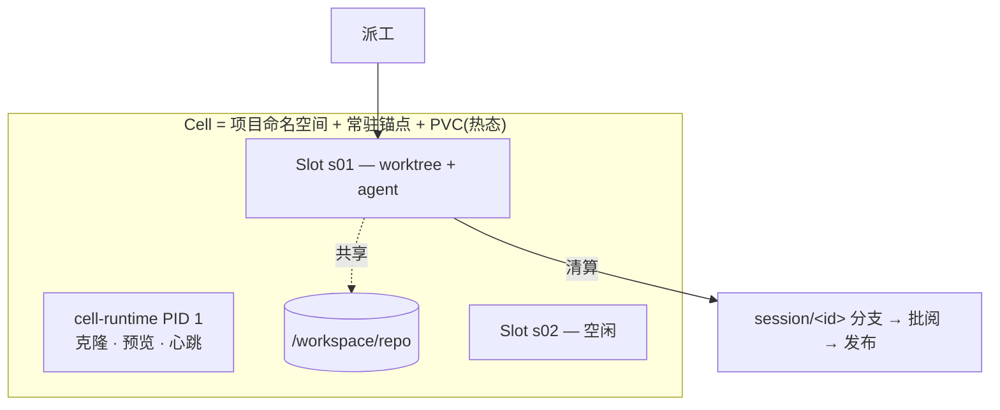

<div align="right">

[English](README.md) · **中文**

</div>

# AgentCell

**AI 开发员工的车间。** 每个项目一个常驻的、跑在 Kubernetes 上的实例(*Cell*);
会话是实例内的一次性工位(Slot);自带常驻产品预览供你边看边校准;SDLC 环——
派工 → 干活 → 清算 → 批阅 → 发布——在实例内闭合。

> **状态:alpha。** 全链路已在真实单节点 k3s 上通过 8 步 e2e(鉴权 → reconcile →
> 预览 → 派工 → 清算 → 推分支 → 发布 → 正式区,[e2e 结果](docs/E2E_RESULTS.md))。
> 批阅/PR 审批队列尚在路线图。用于生产前请先评估——下方表格如实列出"已实现 vs
> 设计目标"。

## 为什么

- **常驻 Cell + 一次性 Slot。** 一次性沙盒每单交冷启动税,人用的 workspace 又不管
  agent。AgentCell 让项目环境保持热态,每个会话独占 git worktree 与资源额度,下线
  走**清算**:有产出推 `session/<id>` 分支,空会话丢弃,不留垃圾。
- **边看边校准。** 每个 Cell 常驻跑产品 dev server;UI 左边是产品描述,右边是实时
  预览——你对着 agent 正在做出来的东西随手校准。
- **凭据够不到。** 模型 key 按会话注入。开启 git-broker(默认)后**没有任何 workload
  pod 持有 forge 令牌**——pod 用 audience 绑定的 ServiceAccount 令牌认证;只有 settle
  角色能 push,且只能 create-only 推自己那一个分支。
- **国内云友好。** 服务商是数据不是代码:阿里百炼、腾讯混元、DeepSeek、Kimi、智谱
  经其 OpenAI/Anthropic 兼容端点开箱即用,免代理。

## 核心模型



完整图(控制面、生命周期、git-broker):**[docs/ARCHITECTURE.md](docs/ARCHITECTURE.md)**。

## 已实现 vs 设计目标

| 能力 | 状态 |
|---|---|
| Cell 控制器(命名空间/PVC/锚点/预览)· 会话生命周期(槽位闸 → settle Job → 回收) | ✅ 有测试 |
| settle 数据安全(推送确认否则重试、永不删未送达 worktree) | ✅ 真 git 测试 |
| 常驻预览 + 校准 UI · 双区发布(`/app`、分支/标签/SHA、回滚) | ✅ |
| 服务商注册表(阿里百炼 / 腾讯混元 / DeepSeek / …) | ✅ 有测试 |
| HTTP 鉴权(Bearer + 登录 cookie,默认拒绝裸启)· 每 Cell NetworkPolicy · PSS restricted · 非 root Pod | ✅ |
| 无竞态槽位租约(含崩溃恢复) | ✅ 有测试 |
| **git-broker**:令牌不进任何 workload pod;按角色 SA;audience 绑定令牌;repo↔凭据绑定;push 经 pod uid+owner 校验;`session/<id>` create-only | ✅ 有测试([ADR-0005](docs/adr/0005-git-broker.md)) |
| 真机 k3s e2e — 全 8 步含预览与正式区 HTTP 200 | ✅([Run 3](docs/E2E_RESULTS.md)) |
| 批阅队列 · diff · 通过即开 PR · merge 跟踪(forge API 经 broker,celld 不持凭据) | ✅ 有测试([ADR-0006](docs/adr/0006-review-queue-and-pr.md)) |
| 终端 attach(tmux over WebSocket) | ⬜ 设计中(M5) |
| agent-sandbox 底座 · Helm chart · 多节点 RWX | ⬜ 设计中 |

## 快速上手

```sh
# 1. 构建镜像并导入集群(单机走 k3s)
make build build-runtime-static
podman build -t ghcr.io/agentcell/celld      -f images/celld/Containerfile .
podman build -t ghcr.io/agentcell/git-broker -f images/git-broker/Containerfile .
podman build -t ghcr.io/agentcell/devbox     -f images/devbox/Containerfile .
for i in celld git-broker devbox; do podman save ghcr.io/agentcell/$i | sudo k3s ctr images import -; done

# 2. 装控制面(k3s: curl -sfL https://get.k3s.io | INSTALL_K3S_MIRROR=cn sh -)
kubectl apply -f config/crd/ -f config/install.yaml

# 3. Secret:API 令牌、git 凭据(绑定到其仓库)、模型 key
kubectl -n agentcell-system create secret generic celld-tokens --from-literal=tokens="$(openssl rand -hex 24)"
kubectl -n agentcell-system create secret generic git-cred --type=kubernetes.io/basic-auth \
  --from-literal=username=bot --from-literal=password=ghp_... \
  --from-literal=repo_url=https://github.com/you/shop.git
kubectl -n agentcell-system create secret generic bailian-key --from-literal=key=sk-...
kubectl -n agentcell-system rollout restart deploy/celld

# 4. 建带常驻预览的 Cell,派工并实时看
cellctl cell create shop --repo https://github.com/you/shop.git \
  --image ghcr.io/agentcell/devbox --secret git-cred \
  --preview "npm run dev -- --host" --preview-port 5173 --description "极简电商"
cellctl dispatch shop --task "把商品卡片改成两列" \
  --runner claude --provider aliyun-bailian --model qwen3-coder-plus --cred bailian-key --follow

# 5. 打开 UI
kubectl -n agentcell-system port-forward svc/celld 8080:80   # http://localhost:8080,用令牌登录
```

生产部署(Ingress/TLS、存储、升级、排障):**[docs/DEPLOYMENT.md](docs/DEPLOYMENT.md)**。

## 组件

- **`celld`** —— `Cell`/`Session` CRD 的 operator + HTTP 面(UI、API、预览/正式区反代)。
- **`git-broker`** —— 唯一持有 forge 凭据的组件,一个认证式 git 代理。
- **`cell-runtime`** —— 静态 multi-call 二进制,anchor/session/prod pod 的 PID 1。
- **`cellctl`** —— 运维 CLI。

部署在任意合规 Kubernetes:自带(单机 k3s = 本地私有云)或云厂商托管(阿里 ACK /
腾讯 TKE),见 [ADR-0003](docs/adr/0003-kubernetes-foundation.md)。

## 文档

[架构](docs/ARCHITECTURE.md) · [部署](docs/DEPLOYMENT.md) ·
[路线图](docs/ROADMAP.md) · [ADR](docs/adr/) ·
[贡献](CONTRIBUTING.md) · [安全](SECURITY.md) ·
[good first issues](https://github.com/zippo1908/agentcell/labels/good%20first%20issue)

## 许可

Apache-2.0,见 [LICENSE](LICENSE)。
