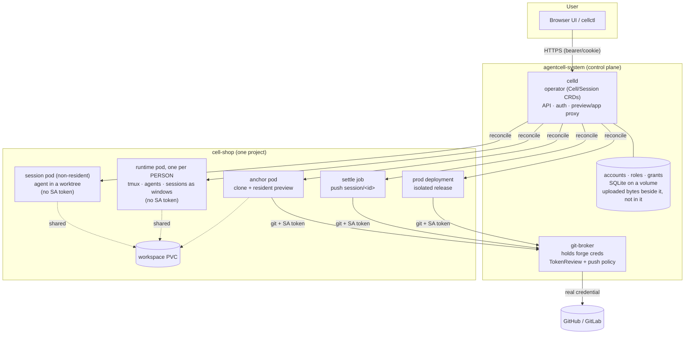
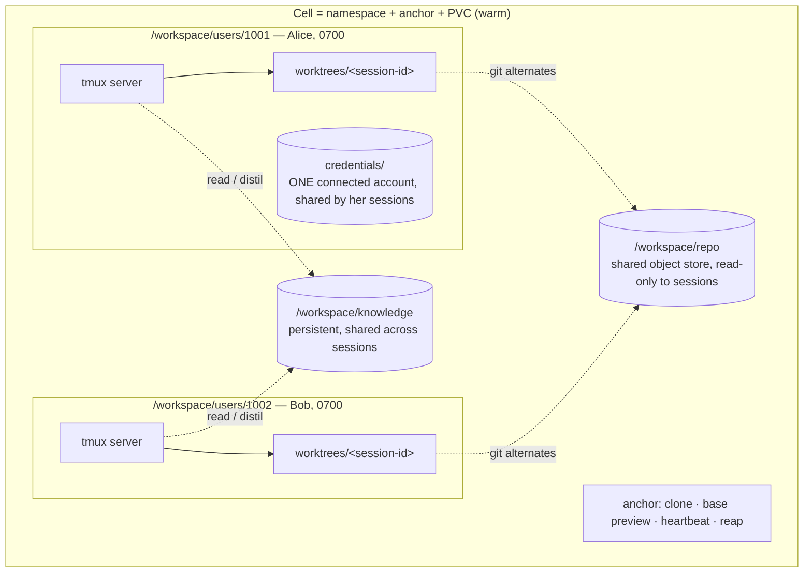
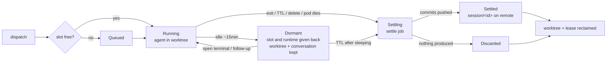
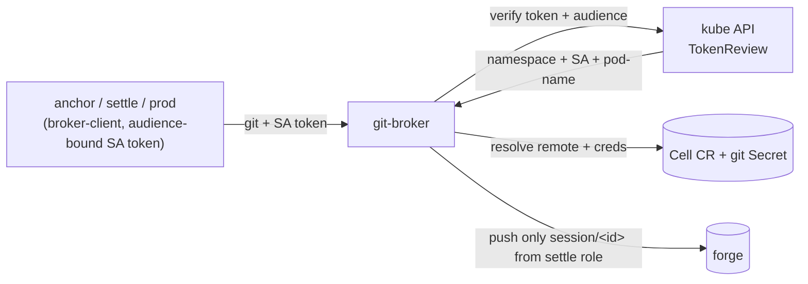

# Architecture

A visual tour of AgentCell. Rationale for each decision lives in
[docs/adr/](adr/); this page shows how the pieces fit.

## Control plane and Cells

Two tiers: a non-root-ish control plane in `agentcell-system`, and one
resident namespace per project. The git-broker is the only component holding
forge credentials.

## Cell anatomy — one warm project, one runtime per person

A session is a **window in its owner's runtime**, not a pod of its own
(ADR-0009, ADR-0010): the agent CLIs already manage several conversations, and
one tmux server per person is what the platform actually has to provide. Each
person gets a Unix uid allocated once and never reused, and a `0700` tree —
which is why one person's unfinished work is invisible to another without any
policy being consulted.

Two directories inside a worktree are put there by the platform rather than by
git: `.agentcell/library/` holds the project's uploaded files as text the agent
reads with its ordinary tools, and it is **topped up while the session runs** —
a file uploaded mid-conversation arrives within a reconcile, without a restart.

## Session lifecycle — settle is mandatory

## git-broker — forge token in no workload pod

Neither session pods nor per-user runtimes carry a ServiceAccount token
(`automountServiceAccountToken: false`) or broker egress, so the processes that
run repository and model code cannot reach the broker at all. See [ADR-0005](adr/0005-git-broker.md) for the full trust
model.
