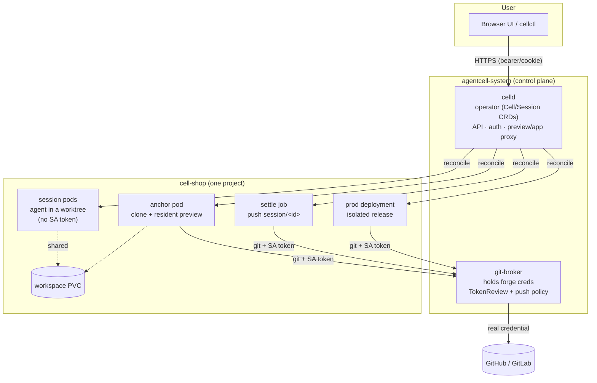
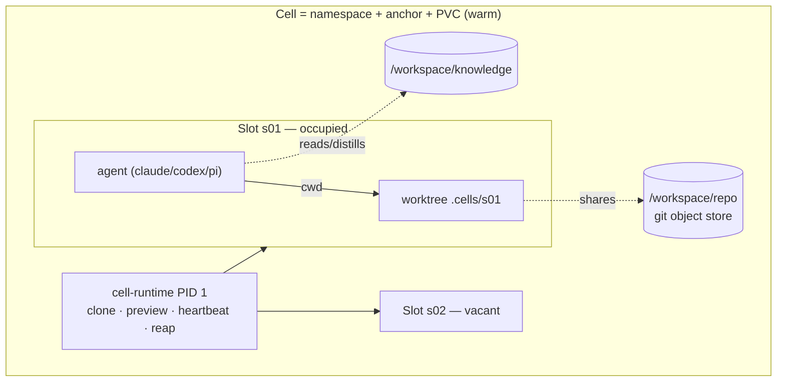
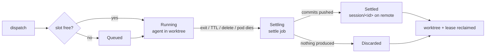
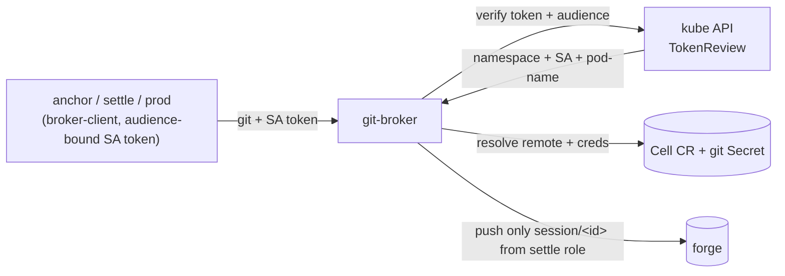

# Architecture

A visual tour of AgentCell. Rationale for each decision lives in
[docs/adr/](adr/); this page shows how the pieces fit.

## Control plane and Cells

Two tiers: a non-root-ish control plane in `agentcell-system`, and one
resident namespace per project. The git-broker is the only component holding
forge credentials.

## Cell anatomy — resident instance, disposable slots

## Session lifecycle — settle is mandatory

## git-broker — forge token in no workload pod

Session pods have **no** token and no broker egress, so they cannot reach the
broker at all. See [ADR-0005](adr/0005-git-broker.md) for the full trust
model.
