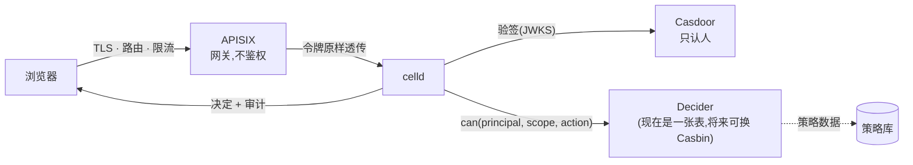

# 统一身份认证

**目标**:让 AgentCell 用公司已有的那一套身份,而不是再养一套账号。

这篇讲的是**认证**——你是谁、怎么证明,以及 Casdoor / APISIX / Casbin
这三样东西各自管什么。**接缝只有一个**:认证产出一个 **Principal**,授权只认它。

---

## 1. 今天已经有什么

AgentCell 从第一版起就把「你是谁」抽象成了一个类型,而不是散在各处:

```go
type Principal struct {
    Subject string  // 稳定、跨签发方唯一
    Name    string
    Email   string
    Kind    Kind    // oidc | user | token
}
```

三种来源,**都已经实现并在用**:

| Kind | 怎么来的 | 用在哪 |
|---|---|---|
| `oidc` | 标准 OIDC 授权码 + PKCE,celld **自己验签** | 企业 SSO,就是这篇要接的 |
| `user` | 平台自己的账号(邮箱 + argon2id 密码) | 现在 151 上跑的 |
| `token` | 静态 Bearer 令牌 | 破窗用:还没有人的时候把部署装起来 |

OIDC 这条路**不是待办,是已完成的**:`internal/identity/oidc.go` 做发现、验签、
`internal/webui/auth.go` 做授权码流程和 PKCE。集群里 Casdoor 也已经部署
(`deploy/identity/casdoor.yaml`)。**只是当前部署没有配 `--oidc-issuer`,所以走的是账号密码。**

### 两个刻意的决定,接 SSO 时不要推翻

**celld 自己验 ID token,不信任网关塞的身份头。** celld 在集群内是可达的,
信任 `X-Forwarded-User` 之类的头,等于让 pod 网络上任何东西都能声称自己是任何人
——身份层就变成装饰品了(ADR-0008)。网关可以在前面挡一道,但**不能是唯一那道**。

**发现是懒加载的,不在启动时做。** IdP 慢启动时,celld 不会 crash-loop。
一个「因为登录服务没起来所以自己也起不来」的控制面,比一个「暂时不能登录」的更糟。

---

## 1.5 Casdoor + APISIX + Casbin:谁说了算

这三样都**能**参与「这个请求准不准」,所以先把分工钉死。否则最后会变成三个地方
都能回答同一个问题——而这正是本仓库今天已经吃过三次亏的形状(凭据「可列出」与
「可使用」不一致、成员表存邮箱而判定用哈希、以及一段永远进不去的死代码),
只不过在架构层面代价大得多。

| | 管什么 | **不**管什么 |
|---|---|---|
| **Casdoor** | 认证。签发 ID token,是**唯一**认人的组件 | 不做授权判定 |
| **APISIX** | 边界:TLS、路由、限流、WAF | **不做鉴权**,不代替 celld 验令牌 |
| **Casbin** | 授权的**计算**:给定主体/对象/动作算出准不准 | 不拥有这个决定——它在 `can()` 那道缝背后 |
| **celld** | **唯一的裁决者** | —— |



### APISIX:为什么它不该鉴权

仓库里 `deploy/identity/apisix.yaml` 已经把理由写在注释里了,这里重述,因为它常被
当成"多加一层更安全":

- **两层各自独立认证,是重定向死循环和 confused-deputy 的来源。** 网关判一次、
  celld 再判一次,两者对"过期"、"受众"、"时钟偏移"的理解稍有不同,就会出现
  "网关放行但应用 401"或者反过来的现象,而两边日志各说各话。
- **网关塞的身份头在这里是可伪造的。** celld 在集群内可达,pod 网络上任何东西都能
  发一个 `X-Forwarded-User`。所以身份头**永远不能是唯一那道**(ADR-0008)。

APISIX 确实要做的是:终止 TLS、按 host 路由、限流、以及**设置**(不是追加)
`X-Forwarded-*`。如果因为它同时挡着别的服务而必须开 `openid-connect` 插件,
那就用 `bearer_only: true` 并把令牌**原样透传**,绝不剥掉再换成一个头。

### 「授权控制面」到底指什么:五个属性

Casdoor/APISIX/Casbin 是零件。**是不是控制面,看的是这五条**——以及这个项目今天
满足到哪:

| | | 现状 |
|---|---|---|
| ① | **唯一判定点**:每个授权问题只有一个地方回答 | Cell 作用域 ✅(14 处 `authorize` + 6 处 `can`,无绕过)<br>平台作用域 ✅(`canPlatform`,2025-08 收口) |
| ② | **策略是数据**:改权限不用发版 | ❌ 仍是 Go 里的 switch |
| ③ | **答得出「为什么」**:决定带理由,可审计 | ✅ 平台作用域已带 `Rule`+`Reason`<br>Cell 作用域仍返回 bool |
| ④ | **可管理**:看得到谁有什么 | 部分:项目成员 UI;**无全局视图** |
| ⑤ | **作用域层级** org→project→资源 | ❌ 只有 cell |

**①③ 是地基,而且都不改变任何人的实际权限**,所以先做。①③ 做完之前谈 Casbin
没有意义:策略引擎接进一个还有侧门的系统,只是让侧门更难被发现。

平台作用域此前是散在两处的 `if p.Admin`,而它们**已经漂移了**:建项目查的是
数据库(`u.Admin`),邀请查的是登录时写进 cookie 的 `p.Admin`。后果是撤销某人的
管理员之后,**建项目立刻失效,邀请要等他重新登录才失效**——两处都"正确",合起来
是错的。收口到 `canPlatform` 时以数据库为准,这条顺带修掉了。

剩下的按顺序:**③ 补 Cell 作用域**(`can` 返回 `Decision`)→ **④ 全局授权视图**
(有了 Reason 才有得可看)→ **② 策略进库** → **⑤ 组织层**,而 ⑤ 的触发条件是
真的出现第二个组织。Casbin 在 ② 那一步进来,只换 `Decider` 一个实现。

### Casbin:放在哪、什么时候放

**放在 `internal/webui/authz.go` 的 `can()` 背后。** 那个函数是本仓库所有 Cell 作用域
判定的唯一出口(21 个调用点无一绕过),它的注释从第一版起就写着这道缝是留给
policy engine 的。Casbin 换进去时,21 个调用点一个都不用动。

**模型选 `rbac_with_domains`**,因为它和现有本体正好对得上:

```
[request_definition]  r = sub, dom, obj, act
[policy_definition]   p = sub, dom, obj, act, eft

sub = Principal.ID()            u-dd7f41d4…
dom = 作用域                     org:tinci / cell:shop
obj = 资源                       cell / session / credential / member
act = 现有的动词                 view / dispatch / review / release / settings
```

**策略数据放策略库,不放 CRD。** 策略是每个请求都要读的东西,不是需要对账的东西;
放进 etcd 只会得到一个又慢又难查询的数据库。Casbin 有现成的 SQL adapter。

**什么时候真正引入。** 三个角色、十来个动词,一张表比一门策略语言更容易读懂和审计
——所以第一阶段**不引入**,只把缝留好。触发条件是规则真的长出了表格表达不了的东西:

- **拒绝规则**(`eft = deny`):"除了 X 谁都行"
- **条件与时限**:临时授权、按环境区分
- **层级**:组织树真的出现第二个组织之后

到那天再插进来,而且**只改 `Decider` 一个实现**。

### Casbin 的一个坑,必须提前知道

**Casdoor 自己内置了 Casbin,并且提供权限 API。** 于是很自然会想:干脆让 Casdoor
把授权也管了。**不要。** 理由不是技术上做不到,而是:

- Casdoor **不知道** Cell、Session、槽位、worktree 是什么。授权规则会退化成粗粒度的
  角色标签,而这个平台真正的边界(「只有会话的 owner 能开终端」)在 IdP 里表达不出来。
- 判定跑到了另一个服务里,**审计线索也跟着分家**——"为什么这个人能进"要跨两个系统
  的日志去拼。
- IdP 挂了会从"登不进新会话"升级成"已登录的人也做不了事"。

**Casdoor 只做认证。** 它内置 Casbin 是它自己的实现细节,不是我们该用的接口。

### 多副本时的另一个坑

Casbin 的 enforcer **把策略缓存在内存里**。celld 一旦多副本,策略改了必须让所有副本
失效(Casbin 的 watcher 机制),否则会出现"我改了权限但有的请求还是旧规则"——
而这种不一致是随机命中哪个副本决定的,极难复现。这件事和多副本要做的另外三件
(策略库换 Postgres、每请求一次 DB 读、内存里的限流器)是同一批,应该一起做。

---

## 2. 唯一真正困难的地方:切换会换掉人的身份

这是这篇文档存在的理由。

Principal 的 `Subject` 决定 `ID()`,而 `ID()` 是**写进 Kubernetes 对象里的那个值**:

```go
ID() = "u-" + hex(sha256(Subject)[:8])
```

同一个人,两种登录方式,算出来是两个人:

```
账号密码  subject=user:zhumingze@us.tinci.com   ->  u-dd7f41d41e4f5437
OIDC     subject=oidc:958ce9f3:zhumingze       ->  u-b5a8e3499eb2168f
```

而这个 ID 决定了**至少四样东西**:

- `Cell.spec.members[].userID` —— 项目成员资格
- Secret 上的 `agentcell.io/owner` 标签 —— 凭据归谁
- `useruid` 分配的 Unix uid —— 也就是 `/workspace/users/<uid>/` 这棵私有树:
  **工作树、CLI 状态、tmux socket、已连接的账号**
- `Session.spec.ownerUserID` —— 谁为这条会话付账,不可变

**所以直接打开 OIDC 开关,每个人都会以一个崭新的陌生人身份登录进来**:项目里没有
他、凭据不是他的、工作树打不开、正在跑的会话不认他。而且**不会有任何报错**——
系统会认为这是一个从没见过的新人,这正是它该有的行为。

> 这不是 bug,是「主体即身份」这个设计的直接后果。它换来的好处是:身份不依赖任何
> 数据库行,存储重建了也不变;而代价就是主体本身必须稳定。

---

## 3. 迁移方案:先建立身份连续性,再切开关

### 第一步:选定并**冻结** subject 的算法

`OIDCSubject(issuer, sub)` 把 issuer 也哈希进去,是为了两个 IdP 恰好用了同一个
`sub` 时不撞车。代价是:**换 issuer URL 就等于换掉所有人的身份。**

所以上线前把这两件事定死,写进部署文档:

- **issuer URL 一个字都不许再改**(包括 http→https、有无末尾斜杠)。
  `--oidc-issuer` 里的值会被 `TrimRight("/")`,但 scheme 和主机名的任何改动都是换人。
- **`sub` 用什么**。Casdoor 可以给 UUID、用户名、邮箱。**选一个此人一辈子不会变的**
  ——邮箱会因为改名、部门调动而变,UUID 不会。选 UUID,把邮箱只当显示用。

### 第二步:身份链接表(必须,不是可选)

在账号库里加一张表,把「旧的 user: 主体」和「新的 oidc: 主体」指向同一个人:

```
identity_links(primary_subject, linked_subject, linked_at, linked_by)
```

解析时:认证产出一个 Principal → 查链接表 → 如果这个 subject 被链接到某个
primary,就用 primary 的 ID。**一个人可以有多个登录方式,只有一个身份。**

这条要放在 `identity` 包里、`ID()` 之前,而**不是**散在各调用点——否则就是又一处
「同一个问题两个函数回答」,而这个仓库已经因为这个吃过三次亏。

### 第三步:自助链接,不是管理员批量改

第一次用 SSO 登录、且这个 subject 没被链接过时:

1. 如果邮箱与某个已有账号相同 → 提示「这看起来是你,用密码确认一次」
2. 密码验证通过 → 写入链接
3. 从此这个人无论用哪种方式登录,都是同一个 ID

**为什么要密码确认**:IdP 上的邮箱声明是可以被管理员改的。仅凭邮箱相同就合并两个
身份,等于让能改 IdP 邮箱的人接管平台上任何一个账号。**一次密码确认把这条路堵死**,
而且只需要做一次。

### 第四步:切换期两种方式并存

账号密码这条路**不要立刻关掉**:

- SSO 出故障时还有路进得来(IdP 是新的单点故障,第一个月一定会有意外)
- 没链接完的人还能登录并完成链接
- 静态令牌**永远保留**:它是把部署装起来的那条路,也是 IdP 彻底不可用时的破窗

链接率到 100% 之后,再把账号密码登录从界面上收起来(**保留后端能力**,只是不 offer)。

---

## 4. 接入清单(实际要做的事)

```bash
celld \
  --oidc-issuer=https://casdoor.tinci.com \
  --oidc-client-id=agentcell \
  --oidc-redirect-url=https://console.tinci.com/oidc/callback
```

IdP 那侧:

- 授权码流程 + PKCE(celld 用的就是这个)
- redirect URI 精确匹配,**不要用通配**
- scopes:`openid profile email`——后两个只影响显示名,不影响身份
- `sub` 稳定不变(见上)

**要一起想清楚的三件**:

**① 预览域是另一个 origin,有它自己的票据。** 不可信内容跑在
`<cell>-<zone>.<domain>` 上(ADR-0007),用一次性票据换 cookie,**从不接受控制台
的会话凭据**。SSO 不能改这件事——把 SSO 会话延伸到预览域,等于把 agent 写的、
没人看过的页面放进你的登录态里。

**② 终端是 WebSocket,走 cookie。** 所以 origin 检查和 CSRF 那道闸不能因为
「已经有 SSO 了」就放松:cookie 会被浏览器自动带上,SSO 不改变这一点。

**③ 机器身份和人的身份是两套。** git-broker 用的是 audience 绑定的
ServiceAccount 令牌(ADR-0005),工作负载 pod **不持有任何能查询控制面的凭据**。
统一认证是**人**的事;不要顺手把机器也塞进 IdP,那会给 pod 一个能反问「我是谁」
的凭据,而那正是这个平台的隔离模型不允许的。

---

## 5. 会话本身

登录之后是一个**签名 cookie**,不是数据库里的一行:

- 签名覆盖身份、过期时间**和密码哈希**——所以改密码会让所有会话立刻失效,
  不需要任何地方记得这些会话存在过
- 7 天滑动窗口:在用就不断续期,闲置一周失效
- HttpOnly、host-only、明文 HTTP 下不带 `Secure`(带了浏览器会静默丢弃)

接 SSO 之后,「改密码即吊销」这条对 OIDC 用户不再成立——**密码不在我们这儿了**。
届时需要的是:IdP 侧登出/禁用 → 平台侧感知。可选做法,按代价从低到高:

1. **缩短 cookie 窗口**(最简单,代价是登录频率)
2. **每人一个撤销 epoch**:签名里带上它,管理员改一次就吊销这个人的全部会话
   ——这也是 celld 多副本要做的三件事之一,可以一起做
3. **后端通道**(OIDC Back-Channel Logout):最完整,也最需要 IdP 配合

---

<details>
<summary><b>English</b> — unified authentication</summary>

**Goal**: AgentCell uses the company's existing identity rather than keeping its own.

The OIDC path is **already implemented** — discovery, verification and the PKCE
authorization-code flow all exist, and Casdoor ships in `deploy/identity/`. The
current deployment simply does not set `--oidc-issuer`, so it uses accounts.

**The one genuinely hard part** is that turning SSO on changes who people are.
`Principal.Subject` determines `ID()`, and that id is what is written into
Kubernetes objects — project membership, credential ownership, the allocated
Unix uid (and therefore the private tree holding worktrees, CLI state and
connected accounts), and a session's immutable payer. The same person logging in
two ways computes to two different ids, and nothing errors: the platform
correctly concludes it has never seen them before.

So the migration is: freeze the issuer URL and the `sub` claim; add an identity
link table consulted inside the `identity` package before `ID()`; let people link
their own accounts with one password confirmation (an email claim alone is not
proof — whoever can edit emails in the IdP could otherwise take over any
account); and keep password login available until every account is linked. The
static token stays forever: it is how a deployment is brought up and how you get
in when the IdP is down.

Three things must not change when SSO lands: the preview origin keeps its own
one-time tickets and never accepts a console session (ADR-0007); the terminal
WebSocket keeps its origin/CSRF checks, because cookies are sent automatically
whatever the login method; and machine identity stays separate from human
identity — workload pods hold no credential that can query the control plane
(ADR-0005), and putting them in the IdP would hand them one.

Finally, "changing your password revokes every session" stops holding once the
password lives in the IdP. Replace it with a per-user revocation epoch carried in
the cookie signature — which is also one of the three things multi-replica celld
needs, so the two are worth doing together.

</details>
