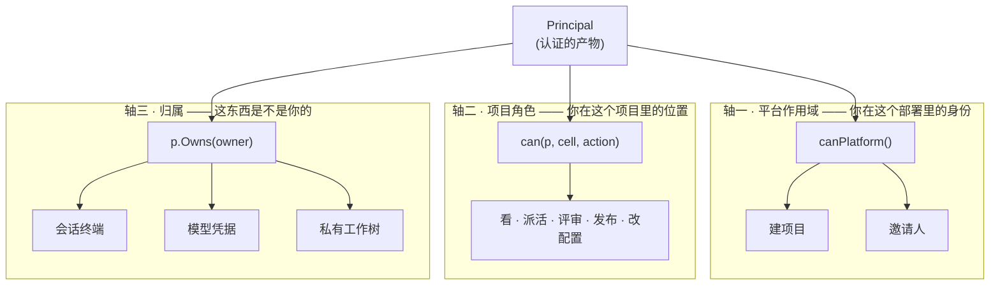
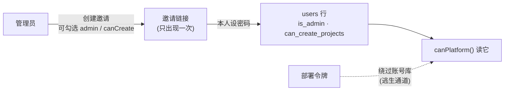
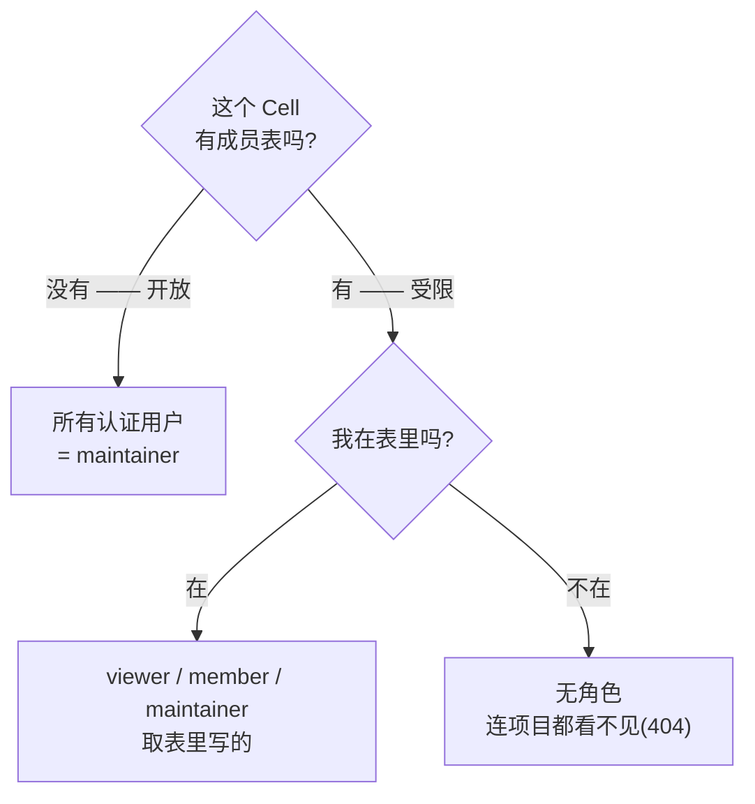
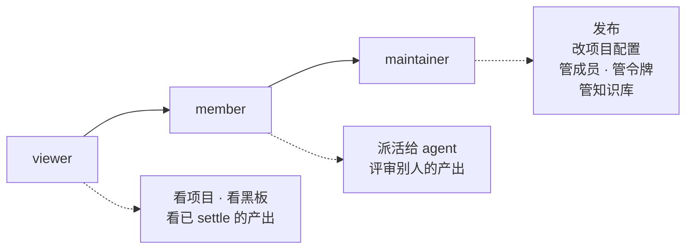
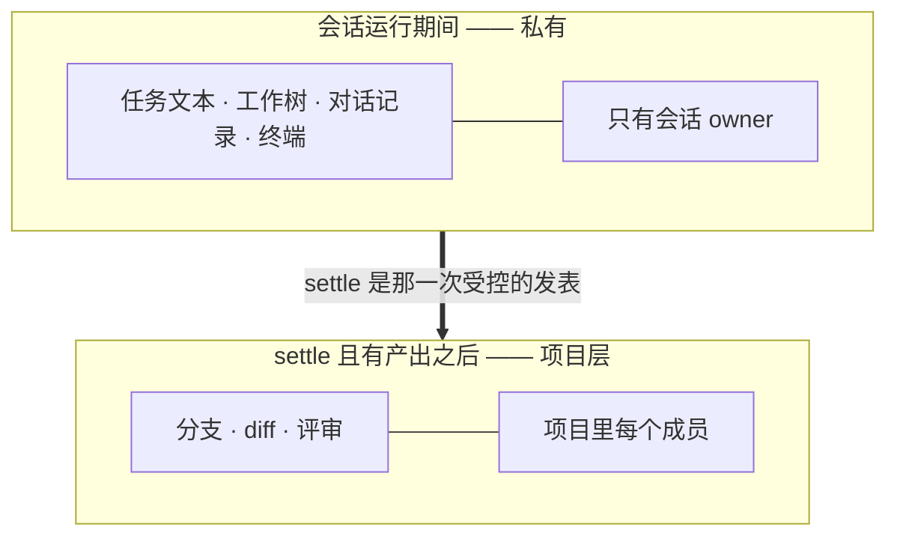
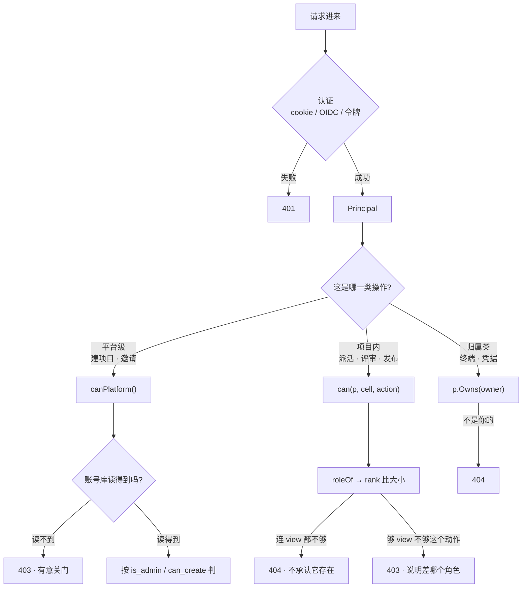

# 谁能做什么

平台怎么管理用户的角色,以及角色怎么影响一个项目里的实际操作。

配套:[AUTHENTICATION.md](AUTHENTICATION.md)(你是谁)、
[ADR-0013](adr/0013-authorization.md)(判定模型)、
[ADR-0015](adr/0015-authorization-fails-closed.md)(故障时关门)。

---

## 0. 先看全貌:授权有三条轴,不是一条

最常见的误解是「角色决定一切」。**不是。** 这个平台上有三条独立的轴,
它们回答的是不同的问题:

**轴三不受角色影响。** 项目 maintainer 也打不开别人的会话终端,也用不了别人的
模型 key。这是设计,不是遗漏——理由见第 4 节。

---

## 1. 平台作用域:角色从哪来

一个人的平台身份存在账号库的 `users` 表里,只有两个开关:

| 字段 | 含义 | 谁能给 |
|---|---|---|
| `is_admin` | 管理员 | 管理员(或部署令牌) |
| `can_create_projects` | 可以建项目 | 管理员,**在邀请那一刻**就能给 |

**判定读的是数据库,不是登录时写进 cookie 的值。** 所以撤销管理员立刻生效。
这一条曾经是错的(建项目读库、邀请读 cookie),两处生效时机不一致。

**读不到就拒绝。** 账号库故障时平台级操作停用,管理员也一并拒绝——因为
「他是不是管理员」正是此刻读不到的那件事。逃生通道只有部署令牌一条,它在
查库之前解析([ADR-0015](adr/0015-authorization-fails-closed.md))。

---

## 2. 项目角色:怎么定出来的

**「加第一个成员」是一个开关。** 成员表为空时项目对所有人开放,而一旦有人被
写进去,项目就有了里外之分。这是刻意的:成员资格是 opt-in,不加成员的老项目
不会因为升级而把人锁在外面。

> **`open` 目前等于 maintainer,这是已知要改的。** 意味着新项目的默认状态是
> 「全部署的人都能从它发布代码」。计划改成 `private`(默认)/ `organization` /
> `open` 三档,且 open 只给 viewer/member,maintainer 只能来自显式授予。
> 见 [ROADMAP](ROADMAP.md) P2。

**找不到角色时返回 404 而不是 403。** 「你无权访问项目 X」本身就泄露了 X 存在。

---

## 3. 角色 → 在产品里具体能干什么

判定是一次比大小:`rank(我的角色) >= rank(这个动作需要的角色)`。

| 动作 | 最低角色 | 在界面上是什么 |
|---|---|---|
| `view` | viewer | 项目可见、黑板可读、已 settle 的分支和 diff 可看 |
| `dispatch` | member | 在黑板上派活、开新会话 |
| `review` | member | 评审队列里通过/打回 |
| `release` | **maintainer** | 发布——**唯一一个把代码送到用户面前的动作** |
| `settings` | **maintainer** | 项目配置、成员管理、令牌管理、知识库写入 |

**`release` 和 `settings` 被单独抬到 maintainer**,理由不对称:其余动作都可以
撤销重来,发布不行。

---

## 4. 轴三:角色管不到的地方

这一节解释「我是 maintainer,为什么看不了他的终端」。

**会话在跑的时候是那个人的执行与记忆边界**,任务文本、工作树、对话记录都不是
别人的事。`settle` 是受控的发表动作:一旦产出了,分支和 diff 就成为项目层的
东西,每个成员都能看和评审。**协作发生在项目层,不是进程层**(ADR-0008)。

同理:

- **模型凭据**按属主判定,借出要显式操作。maintainer 不会自动获得别人的 key。
- **私有工作树**是 `0700` 的目录,归属靠 Unix uid。**socket 本身就是权限**——
  不是应用层多写了一道检查,而是操作系统不让你进。
- 例外只有一个:**黑板的共享会话**。它是项目在说话,所以任何能 `dispatch` 的人
  都能驱动它——一个只有一个人能回话的对话不叫对话。

---

## 5. 一个请求走完的全程

**三条轴各有各的错误码,而且不一样,是有意的**:不够角色说「差什么」,
连看都不该看见的说「不存在」。

---

## 6. 现在做到哪了

| | 一个授权控制面该有的 | 现状 |
|---|---|---|
| ⓪ | 故障时关门 | ✅ [ADR-0015](adr/0015-authorization-fails-closed.md) |
| ① | 唯一判定点 | ✅ 两个作用域各一扇门 |
| ② | 策略是数据,改权限不发版 | ❌ 仍是代码里的表 |
| ③ | 答得出「为什么」 | 平台作用域 ✅(`Rule`+`Reason`);Cell 作用域仍返回 bool |
| ④ | 可管理,看得到谁有什么 | 部分:项目成员 UI,无全局视图 |
| ⑤ | 作用域层级 org→project | ❌ 只有 cell |

推进顺序和理由见 [ROADMAP](ROADMAP.md) 的「Security and identity, in order」。
一句话版:**先别急着决定 JWT 里放哪些 role**——身份是否稳定、网络边界、故障
边界、信任边界都在那一层之下,地基不稳的话,角色模型做得再漂亮也只是控制台
漂亮。
