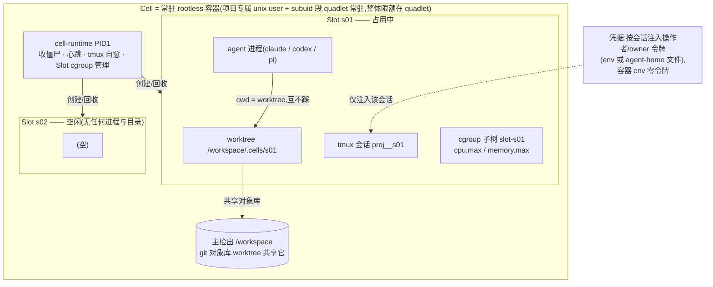
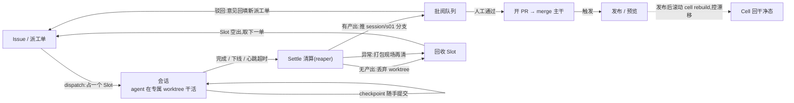
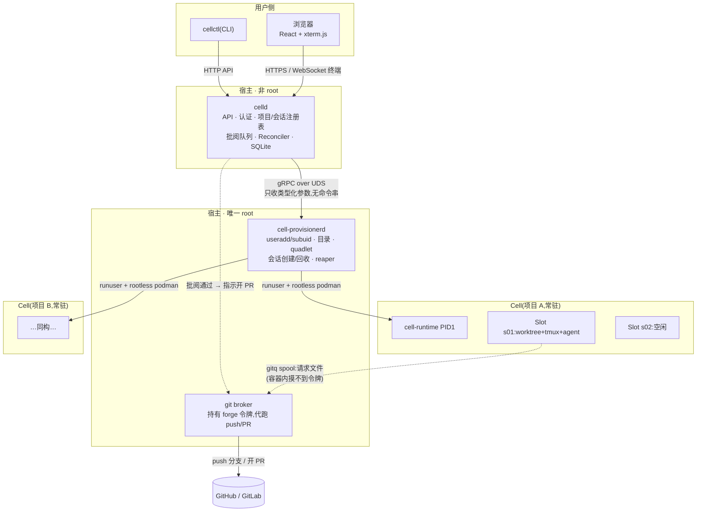

# AgentCell — 开源项目计划

> 一句话:**每个项目一个常驻的"细胞"容器,AI 开发员工以会话槽位(tmux + worktree + cgroup)进驻干活,下线即回收,SDLC 闭环在实例内完成。**
>
> 形态:GitHub 开源项目(Apache-2.0,建议),自托管、单机起步、单二进制安装。
> 执行方式:计划切成 M0–M10 共 11 个任务包,每包可独立派给 Fable 模型完成,人只批阅 PR。

---

## 1. 定位与差异化

| 已有项目 | 它做什么 | 我们的差异 |
|---|---|---|
| Coder / Gitpod | 给**人**开发用的 workspace 编排 | 我们给 **AI agent** 编排常驻工作环境 |
| E2B / Daytona | 给 agent 的**一次性**沙盒(秒级建毁) | 我们是**常驻实例**:检出、依赖、凭据热着,会话才是一次性的 |
| OpenHands / SWE-agent | agent 本体(怎么写代码) | 我们不做 agent,做 agent 的**车间**:槽位、限额、回收、批阅、发布 |
| Sysbox / rootless podman | 隔离原语 | 我们是用这些原语拼出的**平台** |

核心卖点三条:
1. **常驻 Cell + 一次性 Slot**:项目环境零冷启动,并发度=槽位数,资源有 cgroup 硬边界;
2. **SDLC 闭环内建**:issue → 派工到槽位 → agent 干活 → 结算(推分支)→ 批阅 → PR → 发布/预览,不是"给你个沙盒剩下自己想办法";
3. **凭据不进容器**:agent 令牌按会话注入、git 令牌留在宿主 broker 代跑——多人多 agent 共用一个项目不串号。

## 2. 与 AIP 的关系(重要,先拍板)

AIP(`tinci_appstage`)已验证了大半架构,但它是公司内部代码。两条路:

- **A. Clean-room 重写(默认)**:只继承架构与教训,代码全新写。安全,慢一点。
- **B. 申请授权抽取**:把 provisionerd 骨架 / runtime PID1 / 终端链路等无业务代码经公司批准后 Apache-2.0 化。快,但需要走流程。

**未拍板前按 A 执行。** 无论哪条路,以下从 AIP 拿的是"经验"不是代码:

**继承的架构决策**
- 双进程特权分离:非 root 控制面 `celld` + 唯一 root 的 `cell-provisionerd`,UDS gRPC,**RPC 只收类型化参数、永不收命令串/宿主路径**;
- 容器内 PID1 multi-call 二进制(收僵尸/心跳/tmux 自愈);
- 一项目一专属 unix user(nologin、无 sudo)+ rootless podman + subuid 映射;
- git broker spool 模式:容器里只有假 `git` 助手写请求文件,宿主 root 侧用令牌代跑;
- credresolve 语义:"这一刀烧谁的令牌"按操作者解析,不按项目;
- Reconciler 对账 + 指数退避 + 休眠降频。

**修正的已知坑**
- ❌ owner 令牌烧进容器 env(串号源头)→ ✅ 只按会话注入(`tmux set-environment` 一条路);
- ❌ "个人会话"是贴在共享会话旁的补丁,回收逻辑分散 → ✅ Session 一等公民,统一生命周期;
- ❌ tmux/agent 状态是 project 级标量,reconciler 只能整体重建 → ✅ 逐 slot 对账;
- ❌ agent 会话路径写死 `/workspace` → ✅ 每 slot 一个 worktree,路径由 SessionID 派生;
- ❌ quadlet 用 Go 字符串拼 → ✅ 文件模板 + 渲染;
- ❌ 僵尸进程没人记账(踩过僵尸 provisionerd 抢队列)→ ✅ 每会话一个 systemd scope,记账与击杀都是一条 systemctl。

## 3. 核心模型

**Cell 的解剖**——常驻容器就是实例,Slot 是实例内的一次性工位:



会话生命周期:`dispatch(占 Slot)→ work(干活/checkpoint)→ settle(清算)→ reclaim(还 Slot)`。限额机制:quadlet 给容器开 cgroup v2 委托,PID1 在容器内为每个 Slot 建 cgroup 子树写 `cpu.max`/`memory.max`——单会话失控杀子树,单 Cell 失控杀容器,层层有闸。

**实例内 SDLC 闭环**:



**Settle(结算)是回收的前置,不是可选项**:会话结束(正常退出/超时/心跳丢失)时 reaper 必须走清算——有提交→推 `session/s_<id>` 分支并登记到批阅队列;无产出→丢弃 worktree;异常→打包现场(最后 N 行 tmux 输出 + git status)再清。**常驻实例永远不留垃圾。**

**Cell 是宠物但可重建**:`cell rebuild` 随时销毁重建,状态从 git 远端 + 控制面数据库恢复;建议发布后滚动重建,控制环境漂移。

## 4. 架构与技术栈

**宿主总体架构**——两级特权分离,令牌永远不进容器:



### 4.1 "是不是可以不要沙盒?"——沙盒与实例合并为一层

答:**沙盒不被去掉,而是与实例合并**。旧模型里沙盒讨人厌的是"每次派工冷启动 provision"的税;常驻化后这笔税一次性摊销,容器剩下的全是收益:

1. **网络边界可配置**:宿主环回上往往挂着通内网的隧道端口,裸跑的 agent 天然全部摸得到;容器化后"能否摸宿主环回"(`pasta --map-host-loopback`)是 per-Cell 的显式开关。
2. **容器内 root**:agent 自己 apt/npm 装依赖,不需要宿主 sudo——裸跑模式下这个问题无解(要么卡住要么放权)。
3. **可重建性**:`cell rebuild` 一条命令回干净态;裸跑的宿主环境漂移没有回滚键。

对完全信任的场景保留一个轻量选项:**Cell 驱动抽象**——默认驱动 `podman`(容器即 Cell);备选驱动 `host`(unix user + systemd 沙盒指令 `ProtectSystem=strict`/`ReadWritePaths=仅worktree`/`PrivateTmp`/`IPAddressDeny+白名单` + cgroup),约八成防护、零镜像管理。驱动是 Cell 级配置,同一平台可混跑。**默认永远是容器。**

### 4.2 技术栈明细

总原则:**依赖克制、单二进制、自托管零外部服务**——"一台干净机器五分钟跑起来"是开源冷启动的生死线。每层给出选型与被否方案:

| 层 | 选型 | 为什么 / 为什么不是别的 |
|---|---|---|
| 语言 | **Go 1.26+**,`CGO_ENABLED=0` 全静态 | 静态交叉编译(cell-runtime 要注入任意容器,静态是硬需求);goroutine 天然适合 pty/stream 管道;AIP 已验证。不选 Rust:无既验代码、招手快;不选 TS/Node:运行时依赖违背单二进制 |
| 进程间 | **gRPC over UDS**(grpc-go + protobuf) | 类型化契约可冻结、可 mock;UDS + group 权限做特权边界。不选 HTTP/JSON:契约漂移没有编译期约束 |
| 控制面存储 | **SQLite**(modernc.org/sqlite 纯 Go,WAL + busy_timeout,embed 顺序迁移) | 零外部服务、0600 单文件好备份;单机规模远够。不选 Postgres:多一个要运维的东西,反卖点 |
| 隔离原语 | **rootless podman + quadlet** + userns/subuid + **pasta** + **cgroup v2 委托** + **git worktree** + **tmux** | 全是系统自带原语,平台只是编排者。不选 Docker:daemon 常驻 root、无 quadlet;不选 K8s:单机自托管定位,K8s 是反卖点;不选 Firecracker/microVM:v0.1 过重,留作未来驱动 |
| Git 操作 | **系统 git CLI**(exec argv,无 shell) | worktree/凭据边角 go-git 覆盖不全;forge 走 REST 适配器(GitHub→GitLab),broker spool 就是文件系统 JSON |
| 终端链路 | **creack/pty + coder/websocket + @xterm/xterm** | AIP 全链路验证过;二进制帧裸透传,文本帧控制消息 |
| Agent 层 | runner×provider 注册表;headless 走 `claude -p --output-format stream-json` / `codex exec` | 见附录 A;平台不内嵌任何模型 SDK——agent 是外部进程,天生解耦 |
| 前端 | **React 18 + TS + Vite + TanStack Query**,`go:embed` 进 celld | v0.1 只做终端+批阅两页;embed 保住单二进制。不选 SSR/Next:纯管理台不需要 |
| 认证 | 会话 cookie + PAT,x/crypto(argon2) | 自托管先本地账号,OIDC 留接口 |
| 观测 | stdlib `log/slog` + Prometheus `/metrics` | 结构化日志零依赖;指标只加 client_golang 一个依赖 |
| 构建/发布 | Makefile + golangci-lint + GitHub Actions + goreleaser + install.sh | 产物 = 4 个二进制(celld / cell-provisionerd / cell-runtime multi-call / cellctl)+ 一个 devbox 基础镜像(Containerfile,常用工具链;项目可换自定义镜像) |
| 测试 | go test(单元)+ 脚本化真机 e2e(useradd/podman 需真 root,跑自托管 runner 或本地 `make e2e`) | GitHub 托管 runner 只跑 lint+单测+构建;e2e 结果作为 PR 必附证据 |

产品形态决策:**v0.1 CLI-first**——`cellctl` 覆盖全部操作,Web UI 最后做(M9)。依赖总数目标:直接依赖 ≤ 12 个(AIP 是 11 个,证明够用)。

## 5. 里程碑(每个 = 一个可派给 Fable 的任务包)

> 规格:每包一个 GitHub issue,附派工提示词(见 §6);单包控制在 Fable 一到两个会话能完成的量;每包有可机验的 DoD;跨包契约(proto / pkg 接口)在前置包里冻结,后续包不许改签名。

| # | 任务包 | 交付物 | 验收(DoD) |
|---|---|---|---|
| **M0** | 仓库自举 ✅ | LICENSE(Apache-2.0)、go.mod、Makefile、GitHub Actions(fmt+vet+test+build)、README(EN/中文)、`docs/adr/0001` 架构决策、`docs/adr/0002` 云服务接入层(阿里云/腾讯云一等公民)、`configs/providers.yaml` 预置 | CI 绿;README 讲清核心模型 |
| **M1** | 领域与命名 | `pkg/ids`:ULID + 从 ProjectID/SessionID 派生 unix user、容器名、tmux 名、worktree 路径、scope 名(**全平台唯一的命名派生处**);SQLite schema v1 + 迁移框架 | 单测覆盖派生函数;迁移可重放 |
| **M2** | Provisioner 骨架 | `proto/v1`(冻结铁律写进头注释)、UDS gRPC server/client、identity(useradd+subuid)、storage 目录树、mock client | 集成测试:root 下建/删一个项目 user+目录 |
| **M3** | Cell 常驻化 | `cell-runtime` PID1(收僵尸/心跳/umask)、quadlet **文件模板**+渲染、`Provision/Start/Stop/Rebuild` RPC、`cellctl cell up/down/rebuild` | 真机:容器常驻、宿主重启后 quadlet 自动拉起、rebuild 幂等 |
| **M4** | 会话槽位(**核心包**) | `CreateSession/EndSession/ListSessions` RPC:worktree add + Slot cgroup 子树(`cpu.max`/`memory.max`,quadlet 开 cgroup v2 委托、PID1 管理)+ tmux 会话;槽位数上限;**reaper**(会话进程退出/心跳超时→settle→回收) | 真机:两会话并发改同仓不互踩;kill -9 会话进程后 reaper 在 60s 内完成清算;槽满时排队;超限会话被 cgroup 压制而非拖垮 Cell |
| **M5** | 终端链路 | WebSocket→pty→`podman exec tmux attach`;per-slot 输入租约(同 slot 一人可写多人旁观) | 浏览器/CLI attach 同一会话;断开不杀会话 |
| **M6** | Agent 进驻 | agent 注册表(claude/codex/自定义 argv);会话内 agent 监管(退避重启、状态文件);**凭据按会话注入**,容器 env 里零令牌 | 起两个会话分别用不同人的令牌,互相 env 里看不到对方 |
| **M7** | Git 闭环 | 容器内 git 助手 + 宿主 broker(per-session spool);checkpoint;settle 推 `session/*` 分支;forge 适配器(GitHub):开 PR | e2e:派工→agent 改码→settle→GitHub 上出现 PR |
| **M8** | Reconciler + 观测 | 逐 slot 对账(容器/tmux/scope/心跳四维)、退避、休眠降频;`/metrics`;`cellctl doctor` | 手工制造漂移(杀容器/杀 tmux/杀 scope)全部自愈或清算 |
| **M9** | 最小 Web UI | 项目列表、Cell 状态、会话列表(占用/限额/时长)、Web 终端、批阅队列(diff + 通过→开 PR) | 全流程可在浏览器完成一遍 |
| **M10** | v0.1 发布 | install.sh、`docs/`(安装/安全边界/威胁模型/运维)、demo GIF、GitHub Release + goreleaser | 一台干净 Rocky/Ubuntu 机器按 README 从零跑通 e2e |

依赖关系:M0→M1→M2→M3→M4 是主干,M5/M6 依赖 M4,M7 依赖 M4+M6,M8 依赖 M4,M9 依赖 M5+M7,M10 收尾。M5 与 M6 可并行派工。

## 6. 派工方式(给 Fable 的任务包模板)

每个 issue 正文用这个骨架,Fable 拿到即可独立开工:

```markdown
## 目标
(一段话,来自 §5 对应行)

## 上下文
- 必读:docs/adr/0001、pkg/ids/README、proto/v1/*.proto(冻结,不许改签名)
- 本包可改动范围:<目录白名单>
- 禁止:改 proto 签名 / 改他包公共接口 / 引新依赖需在 PR 里单独说明

## DoD(逐条可验)
- [ ] <来自 §5 验收列,拆成可执行命令>
- [ ] go vet + golangci-lint 干净;新代码有测试
- [ ] 更新 docs/ 对应章节

## 验证命令
make test && make e2e-<包名>
```

**用 AIP 给自己接生(dogfood)**:这个仓库本身可以挂进现有 AIP 当一个项目,夜班流按 issue 派工、批阅台过 PR——等 M4 落地后,再把开发迁到 AgentCell 自己身上,自己开发自己。

## 7. 安全边界(v0.1 承诺)

- 容器内近 root,宿主上是无 sudo 的 nologin 用户(userns 映射);
- 禁 privileged / host network / 任意路径挂载 / podman socket;
- provisionerd 是唯一 root,UDS group 限权,RPC 类型化、无 shell;
- 令牌:agent 令牌 per-session 注入不落盘容器;git 令牌只在宿主 broker,容器永远摸不到;
- 每会话 cgroup 限额,单会话失控不拖垮 Cell,单 Cell 失控不拖垮宿主(Cell 级也有 slice 限额)。

## 8. 待拍板(开工前需要你定的)

1. **项目名**:✅ 已定 **AgentCell**(2026-08-08)。本地仓库 `/home/tinci/agentcell`,module `github.com/agentcell/agentcell`(GitHub org/repo 建好后如不同名,首推前 sed 一次 module path 即可)。
2. **License**:建议 Apache-2.0(企业采用友好);MIT 也可。
3. **AIP 代码路线**:§2 的 A(clean-room,默认)还是 B(申请授权抽取)。
4. **GitHub 归属**:个人账号还是新 org;是否从第一天公开(建议私有开发到 M4 有真东西再 public)。

## 附录 A:Agent 适配矩阵(pi / codex / claude / DeepSeek)

设计原则:agent 不硬编码,注册表按 **runner × provider 二维**建模(同一 runner 可配不同 provider),每个 runner 实现五个接口点:①启动 argv;②凭据注入(env **或**文件);③headless 派工方式;④会话文件路径解析;⑤权限旁路参数。

| Runner | 启动/权限旁路 | 凭据注入 | Headless 派工 | 会话路径 | 备注 |
|---|---|---|---|---|---|
| **Claude Code** | `claude --dangerously-skip-permissions` | `CLAUDE_CODE_OAUTH_TOKEN`(env) | `claude -p --output-format stream-json`(最成熟) | `~/.claude/projects/<cwd-slug>/`——**每会话一 worktree ⇒ cwd 不同 ⇒ 会话文件天然按槽位分开** | 一等公民;也是接 Anthropic 兼容 provider 的载体 |
| **Codex CLI** | `codex`;需 `--sandbox danger-full-access` 把内层沙盒让位给容器边界 | `OPENAI_API_KEY`(env)或 `~/.codex/auth.json`(**文件路**) | `codex exec` | `~/.codex/sessions/` | 凭据接口须支持按会话写文件,不只 env |
| **pi** | 极简、无权限门禁,假设跑在容器里——与本模型天然一致 | 各 provider API key(env) | 支持脚本化调用 | 其自有会话目录 | 自身零防护 ⇒ cgroup 限额与 settle 清算是必需品;多 provider,可作 DeepSeek 通道 |
| **DeepSeek** | —(是 provider 不是 runner) | ①Anthropic 兼容端点:`ANTHROPIC_BASE_URL`+`AUTH_TOKEN`+模型名挂 Claude Code(即 AIP 已验证的 Kimi 接法);②OpenAI 兼容端点挂 pi 等 | 随 runner | 随 runner | 若出现第一方 CLI,按五接口点补 runner 条目即可 |

对里程碑的影响:**M1** 领域建模加入 runner×provider 二维;**M6** 凭据注入支持 env 与文件两条路,验收补一条"Codex 在容器内以外层边界运行"。

—— 计划完。拍板 §8 后,M0 的 issue 可以立刻开出来派给 Fable。
