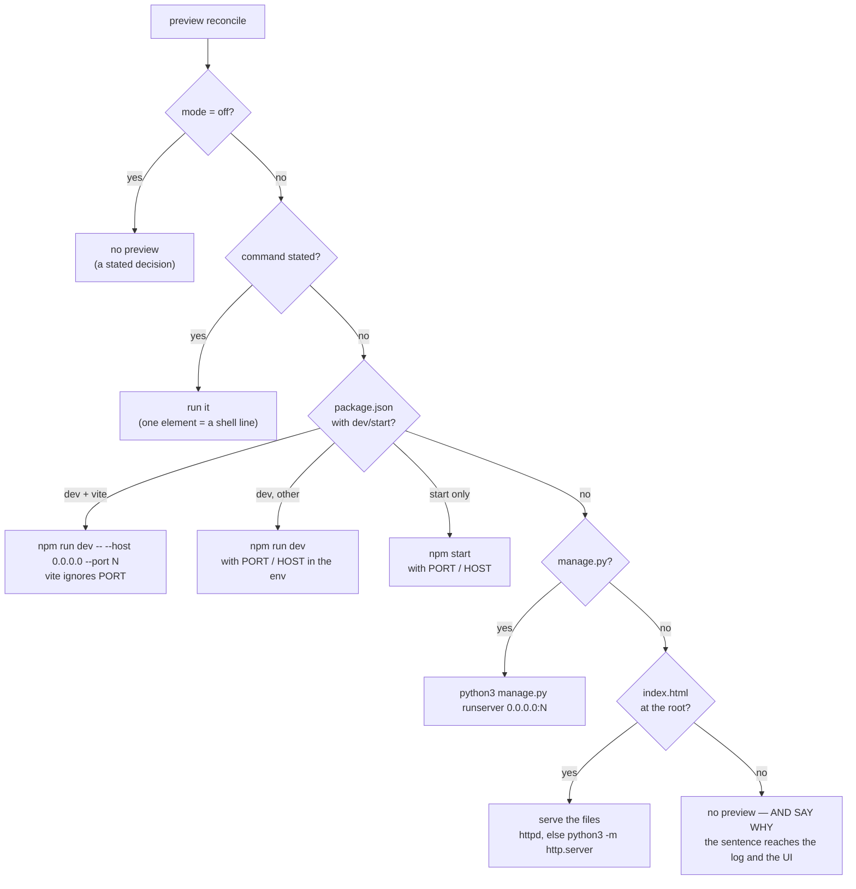

# ADR-0014: A preview nobody has to configure

Status: accepted
Amends: [ADR-0011](0011-git-boundary.md) (which assumed `spec.preview.command` is always given)

## Context

Creating a project asked six free-text questions. Five of them were replaced
by offers — the platform already knows which devbox images an operator
publishes, which credentials exist, which runners and providers are
configured, which machine pools were defined. One survived: the preview
command.

It survived for a bad reason. It looks like a question only the user can
answer, and it is not: the answer is written in the repository, in
`package.json` or a `manage.py` or the presence of an `index.html`. What the
user genuinely cannot answer is that same question **on the day the project
is created**, because at that moment the repository is usually empty — often
it does not exist yet (see the repository-attached-later change in the same
release).

So the field was left blank, which meant no preview at all, and nothing
anywhere said why. The most valuable thing the product does — watch the app
change while the agent works — was opt-in behind a question asked at the one
moment it could not be answered.

There was a second failure hiding underneath. The Cell API says a one-element
command is a shell line (`["npm run dev -- --host"]`). The session path
honoured that; the anchor and production paths exec'd the whole string as a
filename. A project configured the documented way produced:

```
anchor: preview start: exec: "busybox httpd -f -p 3000 -h .":
executable file not found in $PATH
```

every few seconds, forever, behind a readiness probe — which held the anchor
`NotReady` for sixteen hours on our own deployment while the console said
only "Pending". The log had the answer the whole time; nobody had a reason to
open it.

## Decision

**A preview is on by default and its command is derived, not asked for.**

`PreviewSpec` gains a `mode`: empty or `auto` means the platform reads the
checkout and works it out; `off` means never. An explicit `command` still
wins — for a project whose server detection cannot work out, and for the
Cells that already have one.

Detection lives in the runtime (`cmd/cell-runtime/preview_detect.go`), not in
the control plane, because the checkout is what it has to read and only the
runtime can see it. First match wins:



Two details are load-bearing rather than incidental:

- **vite is special-cased** because it ignores `PORT`. Everything else in the
  JS world reads it, and passing vite's flags to something else makes the dev
  server exit on an unknown argument. Getting this wrong yields a server
  listening on 5173 while the platform proxies 3000 — a blank page with a
  healthy-looking process behind it, which is the worst shape a failure can
  take.
- **An app beats its own `index.html`.** A repository with both is a JS app
  whose `index.html` is a template; serving the file would show the un-built
  template and look like a broken build.

**The readiness probe was deliberately NOT extended to auto mode.** Auto
cannot promise a preview — it may legitimately conclude there is nothing to
serve — and probing a promise nobody made is what produced the sixteen-hour
`NotReady`. A stated command is a promise, and a promise is fair to probe.

**"No preview" is never silent.** Detection returns a sentence with the empty
command, and it is printed rather than swallowed. The alternative — an empty
command and no reason — is precisely the bug this replaces.

## Consequences

The create-a-project form no longer has a free-text field. A new project on a
repository the rules recognise gets a working preview with nobody typing
anything.

Detection will be wrong sometimes. That is affordable in a way the previous
failure was not: a wrong guess produces a server that does not come up, with
the command it tried in the log and an explicit `command` available to
override it. The previous failure produced nothing, with no reason anywhere.

The one-element shell-line fix lives in `supervisePreview`, which is shared by
the anchor, production and the session-pod preview — so it also repairs Cells
that already have such a command stored. It is deliberately not applied to a
session's *agent* argv: that is a different array, and wrapping it in `sh -c`
would change how agents are invoked.

Auto mode has unit tests over a temporary directory per rule. It has **not**
been measured against a corpus of real repositories; the hit rate on projects
that are neither a JS app, a Django app nor a static page is unknown, and the
honest expectation is that such projects state a command.
