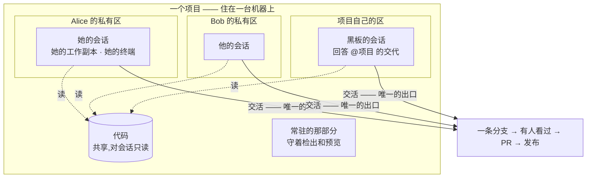
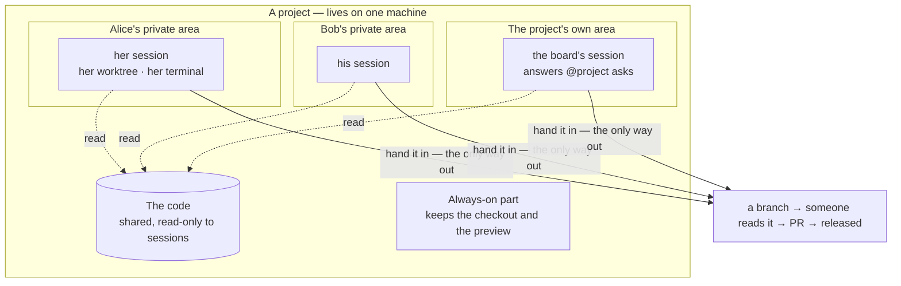

# 概念模型

这一页解释 AgentCell 里那几个名词分别是什么、谁归谁管。
**看懂这张表和下面那张图,基本就会用了。**

| 东西 | 一句话 | 你为什么要在意 |
|---|---|---|
| **项目**(Cell) | 一个仓库,配好环境并一直开着 | 其他一切都挂在它上面 |
| **会话**(Session) | 你在这个项目里的工作副本和终端 | 每人一条;你就是在这儿跟 agent 说话 |
| **黑板**(Board) | 这个项目的消息流 | 在这儿交代活,也在这儿被告知做完了 |
| **槽位**(Slot) | 在一个项目里占用机器的许可 | 限的是同时**几个人**在干活,不是几个任务 |
| **机器池**(PlacementClass) | 管理员**提供**的一类机器 | 这个项目跑在哪台服务器上 |
| **运行时**(Runtime) | 你在这个项目里的那份私有环境 | 别人看不进来,你也看不进别人的 |
| **模型 key**(Credential) | 你的 API key | 自己加、自己花,不会被别人稀里糊涂用掉 |
| **批阅**(Review) | 做完了、等人看的活 | 没经过这一步,不会变成 PR |

## 一张图

这张图该这样读:**项目才是长期存在的那个东西。** 它里面每个人有自己的一角——
自己的文件副本、自己的终端,彼此看不见。项目自己也有一角,黑板上的交代就由它来答。
东西离开这里只有一条路:交活;而且必须有人看过才算数。

Same picture, in English

## 五条推论,值得直说

**一个用户一个 tmux,不是一个会话一个。** agent CLI 自己管理对话,平台
只负责给它私有 `$HOME` 和一个比单次运行活得久的终端。

**每人每项目一条活会话。** 再派工是接进同一条对话。之所以不是"一个任务一条",
是因为 CLI 自己就会开新对话——平台再叠一层,只会让你在槽位满时**回不到自己的活里**。

**会话是一个你能打开并打字的终端。** 不是日志尾巴。headless 的 agent 在结束前
什么都不打印,从外面看"在干活"和"卡死了"完全一样。

**空闲是睡着,不是结束。** 交回槽位和运行时,保留 worktree 和对话;打开终端
或追问一句就在原处醒来。

**清算是进入项目层的唯一一道门。** worktree 可以留多久由属主决定,但任何东西
不经过清算都到不了分支上。

## 状态与期望

| | 含义 |
|---|---|
| `spec.desiredState` | 这条会话**应该**醒着还是睡着(`running` / `dormant`) |
| `status.phase` = `Dormant` | 它**现在**睡着:占存储,不占算力 |
| 唤醒 | 重新拿槽位和运行时、把终端恢复到原处——**绝不重跑 agent** |

睡和醒走的是同一个字段:没人用时 reconciler 写 `dormant`,有人开终端时控制台写
`running`。**用一个可读、可覆盖的字段,而不是把"这个该不该醒着"埋进流逝的毫秒里。**

---

<b>English</b> — the same model

| Thing | In one line | Why you'd care |
|---|---|---|
| **Project** (Cell) | one repository, set up and kept running | everything else hangs off it |
| **Session** | your working copy and terminal in a project | one per person; where you talk to the agent |
| **Board** | the project's message stream | ask for work here; hear back here |
| **Slot** | permission to use the machine in a project | limits how many **people** work there at once |
| **Machine pool** (PlacementClass) | a class of machine an admin offers | which server a project runs on |
| **Runtime** | your private environment inside a project | nobody can see into yours, you cannot see into theirs |
| **Model key** (Credential) | your API key | yours to add and to spend |
| **Review** | finished work waiting to be read | nothing becomes a PR before this |

The five things worth knowing:

- **One workspace per person, not per task.** The agent tools already juggle
  conversations; we do not add a second layer. Asking for another thing
  continues the same conversation.
- **A session is a terminal you can open and type into.** Not a log.
- **Idle means asleep, not finished.** After ~15 minutes unused, a session
  gives back the machine and keeps your files and conversation. Opening it
  wakes it where you left off.
- **Handing work in is the only way out.** Nothing reaches a branch by itself.
- **A project lives on one machine.** More machines means more projects at
  once, not a bigger single project.

