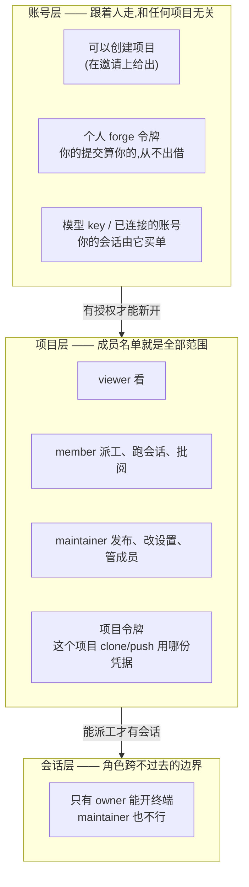

# 权限

## 三层,别混成一层

授权在这里分三层。混淆它们是最常见的困惑来源——尤其是三样都叫「令牌」的东西。

**读法**:账号层回答「这个人是谁、他花谁的钱」;项目层回答「他在这个项目里能做
什么」;会话层是**角色跨不过去**的那条线——项目 maintainer 也打不开你的终端,因为
socket 在你的私有目录里,**它本身就是权限**。

## 三个角色,八个动作

| 角色 | 能做 |
|---|---|
| `viewer` | 看项目、已清算的会话、批阅 |
| `member` | 加上派工、跑会话、批阅 |
| `maintainer` | 加上发布、改设置、管成员 |

**发布是那条要紧的线。** 其他都可恢复;发布是唯一一个把代码摆到用户面前的动作。

## 成员就是范围

**每个项目自己带一份名单。** 这里没有团队这一层:终端、预览、发布本来就都属于
项目,再叠一层等于同一个问题有两个答案,而两个答案迟早会不一致——在团队里但不在
项目上的人,能读到自己打不开的工作的全部讨论。

<!-- 下面这段描述的双向覆盖已随团队一起移除,保留说明只为解释为什么不再需要它 -->
<!-- **项目上点了名的以项目为准,否则用团队的角色。而且覆盖是双向的**——既能提高也能
降低。取两者中较高的看起来大方,实则会让"这个人在这一个项目上只是 viewer"变得
无法表达,而那恰恰是团队需要有的例外。 -->

**点名第一个人就把项目关上。** 一份空名单意味着对所有登录用户开放;写下第一个名字,门就存在了。

## 建项目是一项单独的授权

三个角色说的是**在一个已有项目里**能做什么。「能不能新开一个项目」是另一回事,
它不在项目上,在账号上。

**这项授权长在邀请上**:请人进来的时候勾一下「可以创建项目」,兑换出来的账号就
有。理由是它该由做决定的那个人在做决定的那一刻给出,而不是变成一道要事后记得补
的手续 —— 否则新同事登录进来,发现按钮点了没反应,还得回头找人。

管理员天然有这项授权,不用另外勾。

**升级不会静默降权。** 在这项授权存在之前,任何有账号的人都能建项目;升级时把它
拿走会是一次没人通知、界面上也无从解释的降级。所以已有账号一律保留,新人则只在
邀请写明时才有。

> 建项目在这套系统里意味着一个命名空间、一份 checkout、一个常驻 runtime —— 都是
> 部署要一直扛着的东西,所以它值得是一个显式的决定。

这项授权只对**账号体系里的人**生效。OIDC 用户和静态令牌没有承载它的地方,悄悄收走
那些部署现在就在做的事,会是一次把人打断的升级。

## 借出凭据

新同事在能为一轮对话付账之前,什么都做不了——派工在看项目之前就先要求调用者
自己有凭据。所以一把 key 可以**借**:在「我的凭据」里选一把、填对方邮箱,他就能
在项目里派工,花的是**你的**额度。随时收回。

**已连接的账号也能借**,只是多一步:会话控制器只认「按会话 owner 命名的那份 Secret」,
所以借账号会在对方名下真的放一份拷贝——光记一笔账等于什么都没借。

两份拷贝之后各自刷新,走各自的令牌链。**2026-08-19 实测**(api.kimi.com):换发新的
refresh token **不会作废旧的**——两个运行时先后拿同一个旧令牌刷新,都成功了。所以
分叉是浪费,不是故障。

> 这条曾经被当成「借不了」的理由写进代码和文档,而那个说法从没被验证过。它是错的。

更彻底的做法是**一个人一份凭据、所有会话共用**,不同 session 只做上下文隔离——Kimi
自己文档里 session 就是上下文概念。现在之所以按会话各存一份,是因为 `KIMI_CODE_HOME`
一个变量同时决定了「按人的登录」和「按会话的上下文」两件事。CLI 支持用
`credentials_path` 单独指定凭据位置,所以这条路是通的。

## 有些边界不是角色能跨的

**终端**只有会话的 owner 能开,项目的 maintainer 也不行。socket 在用户私有目录里,
**它本身就是权限**;能看项目 ≠ 能拿别人的键盘。(黑板会话除外——那段对话属于项目。)

**机器池**由集群管理员定义,项目 maintainer 只能在清单里挑。这条尤其重要:
**maintainer 是项目角色,不是集群管理员**,而污点是管理员的拒绝——读到它再自动写上
对应的容忍,不是"放置功能",是绕过。所以 `PUT /placement` **只接受一个 class 名字**,
你送来的任何东西都不会变成节点选择器或 toleration。

## 为什么是 404 不是 403

看不见的项目返回 404,而不是 403。403 等于确认"这个项目存在,而你在外面"——探几次
就能把别人在做什么摸清楚。**只有在你本来就看得见的项目上做不了的动作**,才返回
403 并说明需要什么角色,这样你才知道该找谁要权限。

---

<b>English</b> — permissions

Three roles: `viewer` sees, `member` also dispatches and reviews,
`maintainer` also releases and changes settings. **Release is the line that
matters** — everything else is recoverable; a release is the one action that
puts code in front of users.

<!-- Teams were removed: a project's own member list is the only scope. -->
<!-- **Teams give defaults; a project can override them in both directions.** An
entry naming you on the project wins, whether it raises your role or lowers
it — otherwise "a viewer on this one project" would be unsayable, and that is
exactly the exception a team needs to have. -->

**Creating a project is a separate grant**, carried on the invitation rather
than on any project: the three roles say what you may do *inside* one. It is
given by whoever decides to bring somebody in, at the moment they decide,
rather than as a second act somebody has to remember afterwards. Admins have
it by definition. Accounts that predate the grant keep it — withdrawing it
during an upgrade would be a silent demotion with nothing on screen to explain
it — and it applies only to account holders, since an OIDC user or a static
token has no row to carry it.

**Some boundaries are not role-shaped.** Only a session's owner can open its
terminal — not even a project maintainer — because the socket lives in that
person's private area and seeing a project is not the same as holding
somebody's keyboard. (The team's own board session is the exception: that
conversation belongs to the team.)

**Machine pools are defined by cluster administrators**, and a project
maintainer can only choose from the list. This one matters: a maintainer is
not an administrator, and a taint is an administrator's refusal — reading one
and writing the matching toleration would be a bypass, not a feature.

**Why 404 and not 403:** a 403 confirms that a project exists and that you are
outside it, which over a few probes maps out what a team is working on. You
get 403 only for actions on projects you can already see, and it names the
role you would need — so you know who to ask.

